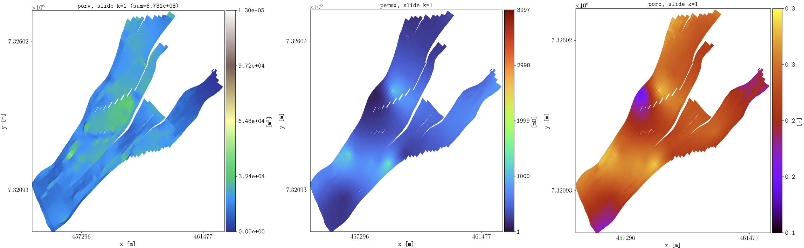

[](https://github.com/cssr-tools/plopm/actions/workflows/CI.yml)
<a href="https://www.python.org/"></a>
[](https://github.com/ambv/black)
[](https://www.gnu.org/licenses/gpl-3.0)
[](https://doi.org/10.5281/zenodo.13332414)


# plopm: A lightweight and flexible tool for visualization and postprocessing of OPM Flow geological models

## Main feature
Quick generation of PNG figures, GIFs, and VTKs from a OPM Flow type model.

## Installation
To install the _plopm_ executable in an existing Python environment: 

```bash
pip install git+https://github.com/cssr-tools/plopm.git
```

If you are interested in a specific version (e.g., v2026.04) or in modifying the source code, then you can clone the repository and install the Python requirements in a virtual environment with the following commands:

```bash
# Clone the repo
git clone https://github.com/cssr-tools/plopm.git
# Get inside the folder
cd plopm
# For a specific version (e.g., v2026.04), or else skip this step (i.e., edge version)
git checkout v2026.04
# Create virtual environment
python3 -m venv vplopm
# Activate virtual environment
source vplopm/bin/activate
# Upgrade pip, setuptools, and wheel
pip install --upgrade pip setuptools wheel
# Install the plopm package
pip install -e .
# Install the dev-requirements
pip install -r dev-requirements.txt
``` 

To use the conversion from OPM Flow output files (i.e., .EGRID, .INIT, .UNRST) to VTK (e.g, to use [_paraview_](https://www.paraview.org) for visualization/postprocessing), [_OPM Flow_](https://opm-project.org) is needed. See the [_installation_](https://cssr-tools.github.io/plopm/installation.html) for further details on installing binaries or building OPM Flow from the master branches in Linux, Windows, and macOS, as well as the LaTeX (optional) dependency. 

## Running plopm
You can run _plopm_ as a single command line:
```
plopm -i name(s)_of_input_file(s)
```
Run `plopm --help` to see all possible command line argument options.

## Getting started
See the [_examples_](https://cssr-tools.github.io/plopm/examples.html) in the [_documentation_](https://cssr-tools.github.io/plopm/introduction.html) and this [_paper_](https://github.com/cssr-tools/plopm/tree/main/paper/paper.pdf).

## Citing
* Landa-Marbán, D. 2026. plopm: A lightweight and flexible tool for visualization and postprocessing of OPM Flow geological models. [https://doi.org/10.13140/RG.2.2.12046.22081](https://doi.org/10.13140/RG.2.2.12046.22081).

## Applications in Scientific Literature

The following is a list of manuscripts in which _plopm_ is used:

* Landa-Marbán, D., Zamani, N., Sandve, T.H., Gasda, S.E., 2024. Impact of Intermittency on Salt Precipitation During CO2 Injection, presented at SPE Norway Subsurface Conference, Bergen, Norway. https://doi.org/10.2118/218477-MS.
* Mykkeltvedt, T.S., Sandve, T.H., Landa-Marbán, D., and  Gasda, S.E., 2026. A Sub-Grid Model for Convective Mixing Applied to the 11th SPE Comparative Solution Project. SPE J. https://doi.org/10.2118/233788-PA.
* Pujol, T., Rowbotham, P., Rose, P., and Maxwell, D., 2026. Prevention and Mitigation Strategy Selection for Salt Deposition in Dry-Out Zone of CCS Aquifer Schemes, presented at 87th EAGE Annual Conference & Exhibition, https://doi.org/10.3997/2214-4609.202610886.
* Sandve, T.H., Boon, W., Landa-Marbán, D., Tveit, S., Gasda, S.E., 2025. Multi-Scale Simulation Strategies for Managing Pressure Interference in Multi-Site CO2 Storage in Large Regional Aquifers, presented at GET 2025, https://doi.org/10.3997/2214-4609.202521134.
* Landa-Marbán, D., Lie, K.-A., Lye, K. O., Møyner, O., Rasmussen, A. F., and T. H., Sandve, 2026. Exploring Convergence and Its Limits in Case B of the 11th SPE Comparative Solution Project. SPE J. https://doi.org/10.2118/231853-PA.
* Landa-Marbán, D., Sandve, T.H., Both, J.W., Nordbotten, J.M., and Gasda, S.E., 2026. Performance of an open-source image-based history matching framework for CO2 storage. Transp Porous Med, https://doi.org/10.1007/s11242-025-02275-0.
* Landa-Marbán, D., Sandve, T.H., and Gasda, S.E., 2025. A Coarsening Approach to the Troll Aquifer Model. https://arxiv.org/abs/2508.08670.

The software also supports the online documentation of several open‑source tools, including:

* [expreccs](https://github.com/cssr-tools/expreccs): A Python framework using OPM Flow to simulate regional and site reservoirs for CO2 storage. 
* [pofff](https://github.com/cssr-tools/pofff): An image-based history-matching framework for the FluidFlower Benchmark using OPM Flow.
* [pycopm](https://github.com/cssr-tools/pycopm): An open-source tool to tailor OPM Flow geological models.
* [pyopmnearwell](https://github.com/cssr-tools/pyopmnearwell): A Python framework to simulate near well dynamics using OPM Flow.
* [pyopmspe11](https://github.com/OPM/pyopmspe11): A Python framework using OPM Flow for the CSP SPE11 benchmark project.

## About plopm
The _plopm_ package is being funded by the [_HPC Simulation Software for the Gigatonne Storage Challenge project_](https://www.norceresearch.no/en/projects/hpc-simulation-software-for-the-gigatonne-storage-challenge) [project number 622059] and [_Center for Sustainable Subsurface Resources (CSSR)_](https://cssr.no) 
[project no. 331841].
Contributions are more than welcome using the fork and pull request approach. For new features, please request them raising an issue.
