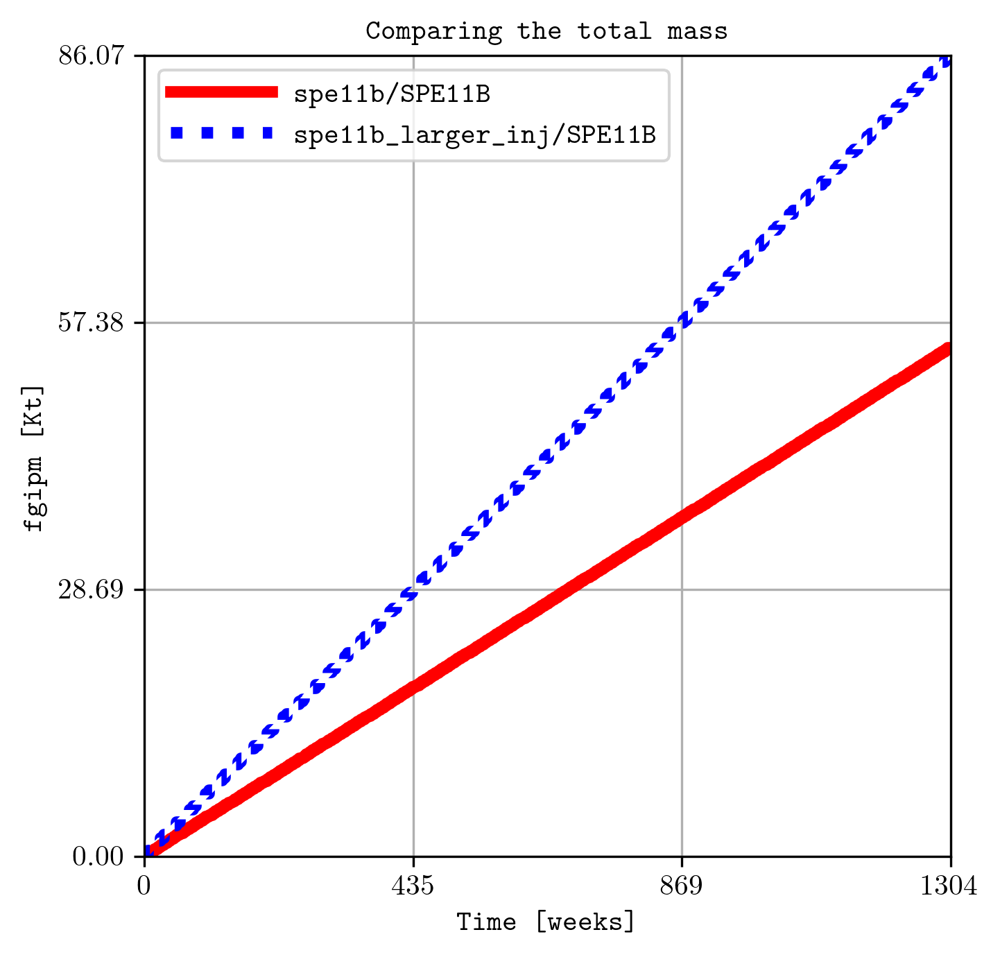

********
Examples
********

======
SPE11B 
======

The simulation files located in the `examples folder <https://github.com/cssr-tools/plopm/blob/main/examples>`_ were generated using 
`pyopmspe11 <https://github.com/OPM/pyopmspe11>`_ by running this `configuration file <https://github.com/OPM/pyopmspe11/blob/main/examples/hello_world/spe11b.txt>`_. 
Then, if you succeed in installing **plopm**, inside the `examples folder <https://github.com/cssr-tools/plopm/blob/main/examples>`_ by typing in the terminal

.. code-block:: bash

    plopm

the following figure should be generated (this example is used in the `tests <https://github.com/cssr-tools/plopm/blob/main/tests>`_, then it runs with the default terminal argument options).

.. figure:: figs/satnum_spe11b.png

The default argument options are:

.. code-block:: bash

    plopm -i SPE11B -o . -v '' -m png -s ,1, -p flow -z yes -f 14 -x '' -y '' -u resdata  -c ''  -e '' -n '' -b '' -d 8,16 -l '' -t '' -r -1 -w 0 -g 0 -a 1 -time s -ylabel '' -xlabel '' -ylnum 4 -xlnum 4 -cnum '' -clabel '' -labels '' -axgrid 1 -dpi 300 -xformat '' -yformat '' -xunits m -yunits m -remove 0,0,0,0 -facecolor w -save '' -log 0 -rotate 0 -translate '[0,0]' -global 0 -ncolor w

See the :ref:`overview` or run `plopm -h` for the definition of the argument options.

For example, for the gas saturation at the report step number 4 using a given colormap (-c):

.. code-block:: bash

    plopm -i SPE11B -v sgas -r 4 -c cubehelix

.. figure:: figs/sgas_spe11b.png

and for the gas in place summary vector given a color, line style, font size, dimension of the figure, and using dates for the times:

.. code-block:: bash

    plopm -i SPE11B -v fgip -c b -e ':' -f 12 -d 5,5 -time dates

.. figure:: figs/fgip_spe11b.png
    :scale: 30%

============
Generic deck 
============

See/run the `test_generic_deck.py <https://github.com/cssr-tools/plopm/blob/main/tests/test_generic_deck.py>`_ 
for an example where **plopm** is used to generate figures from the 
`SPE10_MODEL2 model <https://github.com/OPM/opm-data/tree/master/spe10model2>`_ by downloading the files and using the
`OPM Flow <https://opm-project.org/?page_id=19>`_ simulator.

.. image:: ./figs/spe10.png

.. code-block:: bash

    plopm -i SPE10_MODEL2 -v permz -s ,4, -log 1 -xunits km -yunits km -xlnum 6 -yformat .2f -t 'K$_z$ at the forth slide in the xz plane' -b '[1e-7,1e3]'

Here, we look at the forth slide in the xz plane and use log scale for the permeability in the z direction, as well as changing the axis units to km, 
setting the format to the numbers to two floats in the y axis, and setting manualli the upper and lower bound for the color map.

To plot information for the grid, and also the location of the wells from the top view, this is achieved by:

.. code-block:: bash

    plopm -i SPE10_MODEL2 -s 1,, -d 3,4 -f 8 -g 1 && plopm -i SPE10_MODEL2 -s 1,, -d 3,4 -f 8 -w 1

.. image:: ./figs/wells.png

===============================
Rotation, translation, and zoom
===============================

This example relies on the simulation results in `opm-tests <https://github.com/OPM/opm-tests/tree/master/norne/ECL.2014.2>`_. If you
download the files in that folder, then by using the **plopm** tool:

.. code-block:: bash

    plopm -i NORNE_ATW2013 -s ,,1

these are some of the generated figures:

.. image:: ./figs/norne.png

In order to reduce the white space outside the active cells, as well as to rotate the grid and translate it, this can be ahieved by:

.. code-block:: bash

    plopm -i NORNE_ATW2013 -s ,,1 -rotate 65 -translate '[6456335.5,-3476500]' -x '[0,5600]' -y '[0,7600]' -f 20

.. image:: ./figs/norne_transformed.png

=====================
Different input files 
=====================
Let us assume we have two different runs in different folders for the spe11b case, where the firsts results are save
in a folder called spe11b, and simulation results where the injection rate has been increased are saved in a folder
called spe11b_larger_inj. Then, to plot the summary vector for both runs we can execute:

.. code-block:: bash

    plopm -i spe11b/SPE11B,/home/user/spe11b_larger_inj/SPE11B -v fgipm -a 1e-6 -time w -d 5,5 -c r,b -e 'solid;:' -t 'Comparing the total mass' -f 10

Here, we plot the injected mass and scaled to kilo tons, and the time is shown in weeks.

.. tip::
    For any summary variable, one can give the path to more than two different simulation cases, just by separating the folder paths by commas in the -i.

To look at the difference between these two simulations for the dynamic variable sgas at the restar step 3, this can be achieved by executing:

.. code-block:: bash

    plopm -i spe11b/SPE11B,spe11b_larger_inj/SPE11B -v sgas -r 3

.. image:: ./figs/sgas_diff.png

To changue the colormap and setting the clorbar limits manually, this can be achieved by:

.. code-block:: bash
    
    plopm -i spe11b/SPE11B,spe11b_larger_inj/SPE11B -v sgas -r 3 -c tab20c -b '[-0.8,0]' -n "lambda x, _: f'{x:.3f}'"

.. image:: ./figs/sgas_diff_edit.png

==============
Convert to VTK 
==============
Inside the `examples folder <https://github.com/cssr-tools/plopm/blob/main/examples>`_, then we can create VTKs from the
OPM Flow simulation results (i.e., .EGRID, .INIT, .UNRST). For example, to create VTKS for the temperature, fipnum, and the co2 mass 
from the restart files from the initial (0) to the number 5 restart, using a OPM Flow build from source in a given path, this can be achieved by:

.. code-block:: bash
    
    plopm -i SPE11B -v temp,fipnum,co2m -r 0,5 -m vtk -p /Users/dmar/build/opm-simulators/bin/flow

.. figure:: ./figs/vtk_temp.png

    Visualization using paraview of the grid and temperature after 25 years of CO2 injection.

.. note::

    It is possible to write directly VTKs from OPM Flow simulations by adding the flag **--enable-vtk-output=true**.
    However, there are quantities that are not written (e.g., fipnum, flores), in addition to quantities not supported
    such as component mass (e.g., co2, h2o). This is when **plopm** can be helpful.