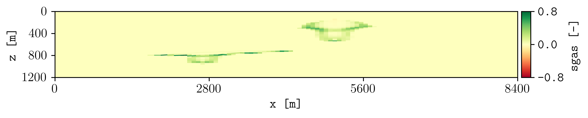

********
Examples
********

======
SPE11B 
======

The simulation files located in the `examples folder <https://github.com/cssr-tools/plopm/blob/main/examples>`_ were generated using 
`pyopmspe11 <https://github.com/OPM/pyopmspe11>`_ by running this `configuration file <https://github.com/OPM/pyopmspe11/blob/main/examples/hello_world/spe11b.txt>`_. 
Then, if you succeed in installing **plopm**, inside the `examples folder <https://github.com/cssr-tools/plopm/blob/main/examples>`_ by typing in the terminal

.. code-block:: bash

    plopm

the following figure should be generated (this example is used in the `tests <https://github.com/cssr-tools/plopm/blob/main/tests>`_, then it runs with the default terminal argument options).

.. figure:: figs/satnum_spe11b.png

The default argument options are:

.. code-block:: bash

    plopm -i SPE11B -o . -s ,1, -f 14 -x '' -y '' -z yes -u resdata -v '' -c '' -n '' -l '' -r -1 -w 0

See the :ref:`overview` or run `plopm -h` for the definition of the argument options.

For example, for the gas saturation at the report step number 4:

.. code-block:: bash

    plopm -i SPE11B -v sgas -c cubehelix -r 4 -n "lambda x, _: f'{x:.2f}'"

.. figure:: figs/sgas_spe11b.png

and for the gas in place summary vector:

.. code-block:: bash

    plopm -i SPE11B -v fgip -c k

.. figure:: figs/fgip_spe11b.png
    :scale: 20%

=====
Norne 
=====

This example relies on the simulation results in `opm-tests <https://github.com/OPM/opm-tests/tree/master/norne/ECL.2014.2>`_. If you
download the files in that folder, then by using the **plopm** tool:

.. code-block:: bash

    plopm -i NORNE_ATW2013 -o . -s ,,1 -x 455600,462200 -y 7319500,7327100

these are some of the generated figures:

.. image:: ./figs/plopm.png

Here, we plot the top view (xy axis, k=1), and we set the xlim (-x) and ylim (-y) in order to reduce the white space outside the active cells.

============
Generic deck 
============

See/run the `test_generic_deck.py <https://github.com/cssr-tools/plopm/blob/main/tests/test_generic_deck.py>`_ 
for an example where **plopm** is used to generate figures from the 
`SPE10_MODEL2 model <https://github.com/OPM/opm-data/tree/master/spe10model2>`_ by downloading the files and using the
`OPM Flow <https://opm-project.org/?page_id=19>`_ simulator.

.. image:: ./figs/spe10.png

.. code-block:: bash

    plopm -i SPE10_MODEL2 -o . -s 4,,

To plot the location of the wells from the top view, then:

.. code-block:: bash

    plopm -i SPE10_MODEL2 -w 1

.. image:: ./figs/wells.png
    :scale: 20%

=====================
Different input files 
=====================
Let us assume we have two different runs in different folders for the spe11b case, where the firsts results are save
in a folder called spe11b, and simulation results where the injection rate has been increased are saved in a folder
called spe11b_larger_inj. Then, to plot the summary vector for both runs we can execute:

.. code-block:: bash

    plopm -i spe11b/SPE11B,/Users/dmar/spe11b_larger_inj/SPE11B -v tcpu -d 5,5 -c r,b -e 'solid;:' -t 'Comparing the simulation times' -f 10 

.. image:: ./figs/tcpu.png

Here, we have lower the size of the figure to 5,5 inches, set to use red and blue colors with solid and dotted lines, as well as settting the title and lower the font size to 10.

.. tip::
    For any summary variable, one can give the path to more than two different simulation cases, just by separating the folder paths by commas in the -i.

To look at the difference between these two simulations for the dynamic variable sgas at the restar step 3, this can be achieved by executing:

.. code-block:: bash

    plopm -i spe11b/SPE11B,spe11b_larger_inj/SPE11B -v sgas -r 3

To changue the colormap and setting the clorbar limits manually, this can be achieved by:

.. code-block:: bash
    
    plopm -i spe11b/SPE11B,spe11b_larger_inj/SPE11B -v sgas -r 3 -c tab20c -b '[-0.8,0]'

==============
Convert to VTK 
==============
Inside the `examples folder <https://github.com/cssr-tools/plopm/blob/main/examples>`_, then we can create VTKs from the
OPM Flow simulation results (i.e., .EGRID, .INIT, .UNRST). For example, to create VTKS for the temperature from the restart 
files from the initial (0) to the number 5 restart, using a OPM Flow build from source in a given path, this can be achieved by:

.. code-block:: bash
    
    plopm -i SPE11B -v temp -r 0,5 -m vtk -p /Users/dmar/build/opm-simulators/bin/flow

.. figure:: ./figs/vtk_temp.png

    Visualization using paraview of the grid and temperature after 25 years of CO2 injection.

.. note::

    It is possible to write directly VTKs from OPM Flow simulations by adding the flag **--enable-vtk-output=true**.
    However, there are quantities that are not written (e.g., fipnum, flores). This is when **plopm** can be helpful.