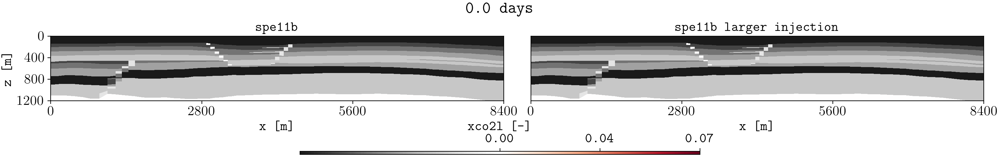
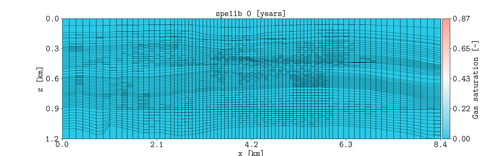

.. _example-animations:

GIFs and masks
==============

Create GIF animations from restart steps and use a static model property as a
background mask.

Prepare the comparison cases
----------------------------

This example compares a base SPE11B simulation with a second case that uses
twice the injection rate.

Install **pyopmspe11**, download the example configuration, and create the
higher-rate configuration:

.. code-block:: console

   pip install git+https://github.com/OPM/pyopmspe11.git
   curl -L -O https://raw.githubusercontent.com/OPM/pyopmspe11/main/examples/spe11b.toml
   cp spe11b.toml spe11b_larger_inj.toml
   sed -i.bak 's/0.035/0.07/g' spe11b_larger_inj.toml
   rm -f spe11b_larger_inj.toml.bak

Run both simulations:

.. code-block:: console

   pyopmspe11 -i spe11b.toml -o spe11b -fz 0
   pyopmspe11 -i spe11b_larger_inj.toml -o spe11b_larger_inj -fz 0

The first case uses the injection rate defined in ``spe11b.toml``. The second
configuration replaces ``0.035`` kg/s with ``0.07`` kg/s.

Create a masked comparison
--------------------------

Plot the liquid-phase CO2 mass fraction from both simulations and use
``satnum`` as a static background mask:

.. code-block:: console

   plopm -v xco2l -sg 1,2 -i 'spe11b/SPE11B spe11b_larger_inj/SPE11B_LARGER_INJ' -fs 16,2.5 -mv satnum -r 0,1,2,3,4,5 -m gif -dpi 1000 -t 'spe11b  spe11b larger injection' -fz 16 -gi 1000 -gl 1 -cbf .2f -cbp 0.30,0.01,0.4,0.02

   Liquid-phase CO2 mass fraction for the base case and the case with the
   larger injection rate. ``satnum`` provides the static background mask.

The principal options are:

* :option:`plopm -m` selects GIF output.
* :option:`plopm -r` selects the restart steps used as frames.
* :option:`plopm -mv` selects the static mask variable.
* :option:`plopm -sg` places both cases in one figure.
* :option:`plopm -gi` sets the interval between frames in milliseconds.
* :option:`plopm -gl` enables continuous looping.

Animate gas saturation
----------------------

Create an unmasked gas-saturation animation, display the grid edges, and show
the spatial coordinates in kilometres:

.. code-block:: console

   plopm -i spe11b/SPE11B -v sgas -tu y -c cet_cwr -ge 'black,5e-3' -fs 16,5 -m gif -dpi 1000 -fz 20 -gi 1000 -gl 1 -cbf .2f -asp 0 -xu km -yu km -xf .1f -yf .1f -cbn 5 -cbl 'Gas saturation [-]'

   Gas saturation through time with visible grid edges and distances expressed
   in kilometres.

Here, :option:`plopm -ge` controls the grid-edge color and width,
:option:`plopm -asp` disables equal axis scaling, and
:option:`plopm -tu` displays time in years.

.. tip::

   Use ``-tu empty`` to hide the time label from the animation.

Reproduce this example
----------------------

Run the complete workflow from the repository root:

.. code-block:: console

   . ./tests/scripts/docs_gif_mask.sh

.. grid:: 1 2 2 2
   :gutter: 2

   .. grid-item::

      .. button-link:: https://github.com/cssr-tools/plopm/blob/main/tests/scripts/docs_gif_mask.sh
         :color: primary
         :outline:
         :expand:

         View script

   .. grid-item::

      .. button-link:: https://raw.githubusercontent.com/cssr-tools/plopm/main/tests/scripts/docs_gif_mask.sh
         :color: secondary
         :outline:
         :expand:

         View raw script

.. button-ref:: examples-gallery
   :ref-type: ref
   :color: primary
   :outline:

   Back to the examples gallery
