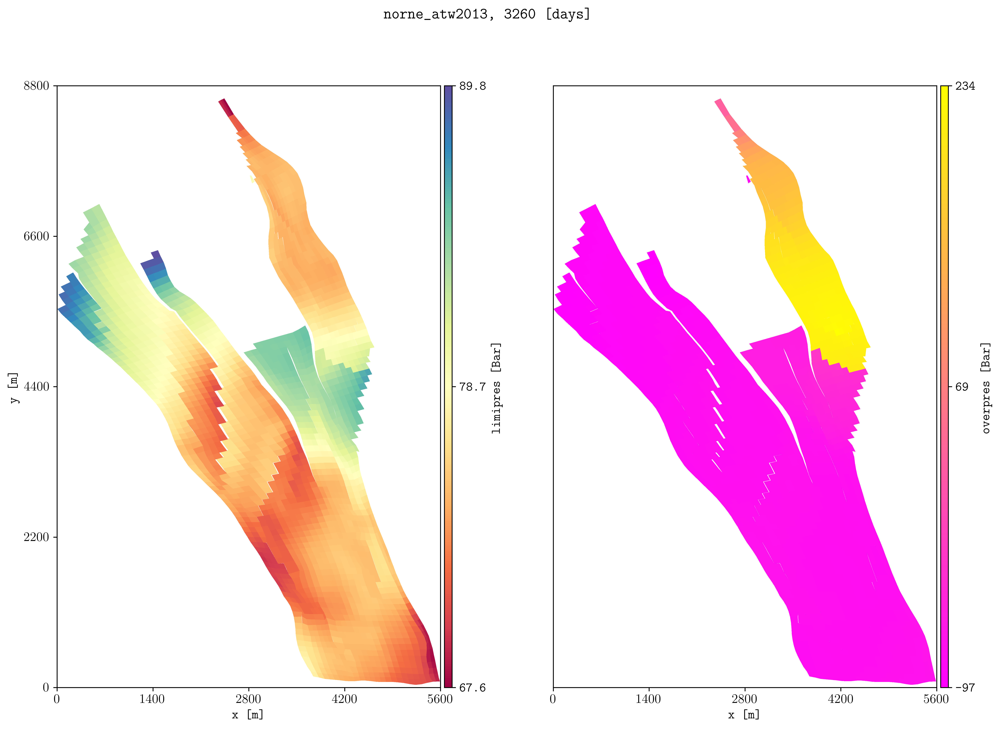

.. _example-caprock:

Caprock integrity
=================

Evaluate pressure limits and identify regions where reservoir pressure exceeds
the estimated caprock pressure limit.

The special variables ``limipres``, ``overpres``, and ``objepres`` support
caprock-integrity analysis:

``limipres``
   Estimated limiting pressure based on depth and the stress coefficient.

``overpres``
   Difference between the simulated pressure and the estimated limiting
   pressure. Positive values identify cells where the pressure exceeds the
   estimated limit.

``objepres``
   Objective value derived from the pressure-limit calculation. This quantity
   can be exported to CSV for use in optimization and sensitivity workflows.

The pressure-limit calculation uses the stress coefficient selected with
:option:`plopm -sc`.

Plot limiting and excess pressure
---------------------------------

Project the first 22 layers of the Norne model and compare ``limipres`` with
``overpres``:

.. code-block:: console

   plopm -i NORNE_ATW2013 -s ',,1:22 ,,1:22' -v limipres,overpres -rot 65 -tr '[6456335.5,-3476500]' -x '[0,5600]' -y '[0,8800]' -fs 15,10 -c Spectral,spring -sg 1,2 -rdl 1

   Limiting pressure and excess pressure projected across layers 1 through 22
   of the Norne model.

The command applies the same spatial selection to both quantities:

* :option:`plopm -s` selects layers 1 through 22.
* :option:`plopm -rot` rotates the Norne grid.
* :option:`plopm -tr` translates the rotated coordinates.
* :option:`plopm -x` and :option:`plopm -y` crop the displayed region.
* :option:`plopm -sg` places both quantities in one row with two panels.
* :option:`plopm -rdl` removes repeated axis labels from the subplot layout.

Export the objective value
--------------------------

Export ``objepres`` for the same layers as a CSV file:

.. code-block:: console

   plopm -i NORNE_ATW2013 -m csv -v objepres -s ',,1:22'

The CSV output can be used as an objective value in optimization, uncertainty
quantification, and sensitivity studies.

Change the stress coefficient
-----------------------------

The default stress coefficient is ``0.134``. Select another value with
:option:`plopm -sc`:

.. code-block:: console

   plopm -i NORNE_ATW2013 -s ',,1:22 ,,1:22' -v limipres,overpres -sc 0.15 -rot 65 -tr '[6456335.5,-3476500]' -x '[0,5600]' -y '[0,8800]' -fs 15,10 -c Spectral,spring -sg 1,2 -rdl 1

Changing the stress coefficient changes the estimated limiting pressure and,
consequently, the calculated excess-pressure and objective values.

Reproduce this example
----------------------

Run the complete workflow from the repository root:

.. code-block:: console

   . ./tests/scripts/docs_caprock_integrity.sh

.. grid:: 1 2 2 2
   :gutter: 2

   .. grid-item::

      .. button-link:: https://github.com/cssr-tools/plopm/blob/main/tests/scripts/docs_caprock_integrity.sh
         :color: primary
         :outline:
         :expand:

         View script

   .. grid-item::

      .. button-link:: https://raw.githubusercontent.com/cssr-tools/plopm/main/tests/scripts/docs_caprock_integrity.sh
         :color: secondary
         :outline:
         :expand:

         View raw script

.. button-ref:: examples-gallery
   :ref-type: ref
   :color: primary
   :outline:

   Back to the examples gallery
