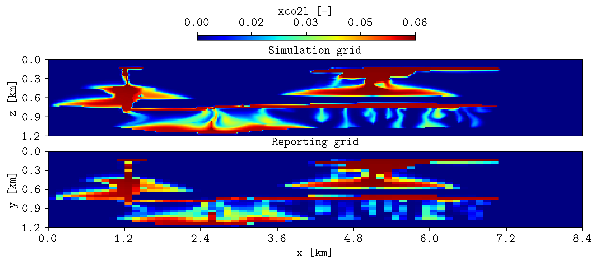
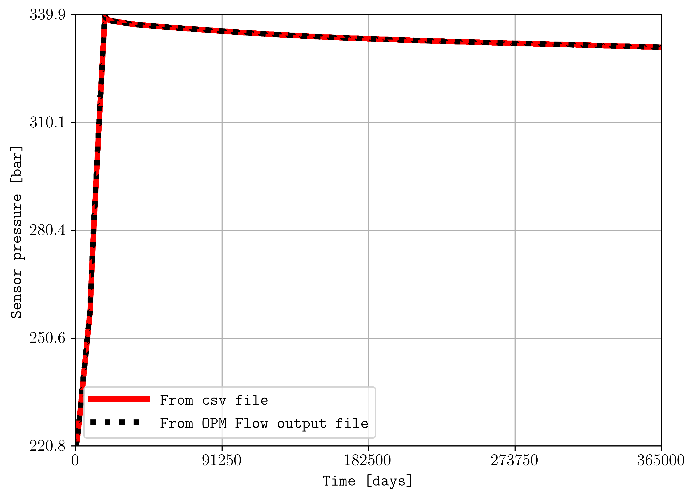
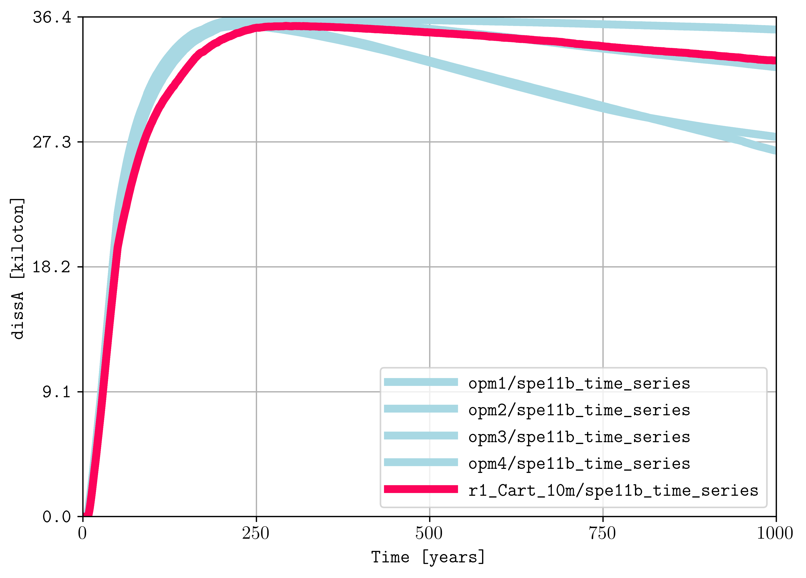
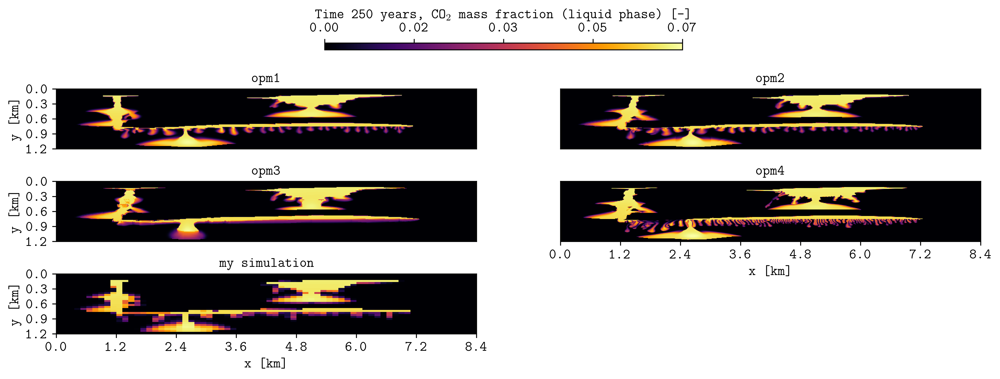

.. _example-csv:

Reading CSV files
=================

Combine CSV and OPM Flow data.

Use :option:`plopm -cc` to combine CSV and OPM Flow data.

.. code-block:: console

   plopm -v xco2l -i 'r1_Cart_10m/R1_CART_10M r1_Cart_10m/spe11b_spatial_map_500y' -cc ';1,2,5' -sg 2,1 -rdl 1 -r 100 -fs 10,3 -st 0 -t 'Simulation grid  Reporting grid' -cbp 0.35,0.97,0.3,0.02 -yu km -xu km -yf .1f -xf .1f -cbn 5 -xnt 8 -cbf .2f

Compare a CSV series with an OPM summary vector.

.. code-block:: console

   plopm -i 'r1_Cart_10m/spe11b_time_series r1_Cart_10m/R1_CART_10M' -v ',BWPR:256,1,5' -cc '1,3;' -sf '1e-5,1' -ls 'solid,dotted' -lw '4,4' -yl 'Sensor pressure [bar]' -llb 'From CSV file  From OPM Flow output file' -c 'r,k'

Compare several benchmark series.

Compare several benchmark spatial maps.

Reproduce this example
----------------------

Run the complete workflow from the repository root:

.. code-block:: console

   . ./tests/scripts/docs_reading_csvs.sh

.. grid:: 1 2 2 2
   :gutter: 2

   .. grid-item::

      .. button-link:: https://github.com/cssr-tools/plopm/blob/main/tests/scripts/docs_reading_csvs.sh
         :color: primary
         :outline:
         :expand:

         View script

   .. grid-item::

      .. button-link:: https://raw.githubusercontent.com/cssr-tools/plopm/main/tests/scripts/docs_reading_csvs.sh
         :color: secondary
         :outline:
         :expand:

         View raw script

.. button-ref:: examples-gallery
   :ref-type: ref
   :color: primary
   :outline:

   Back to the examples gallery
