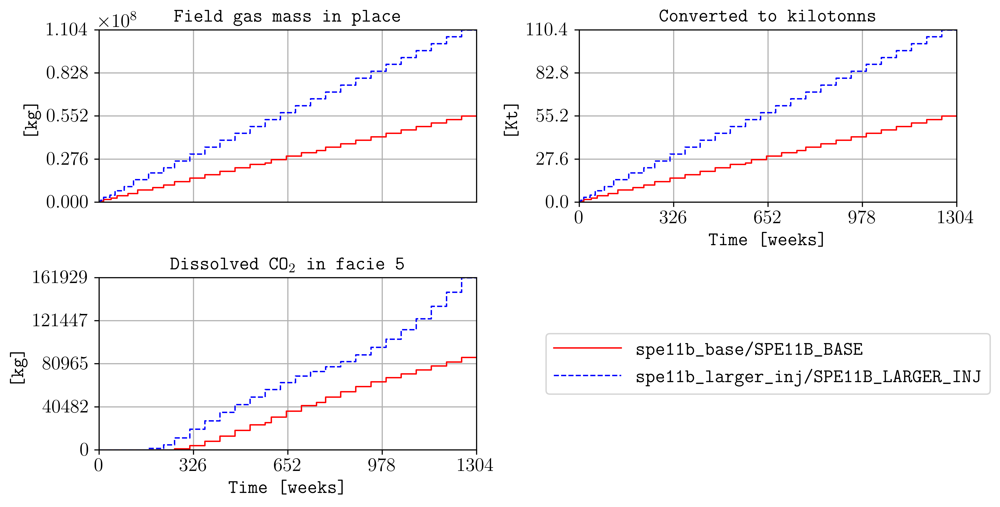
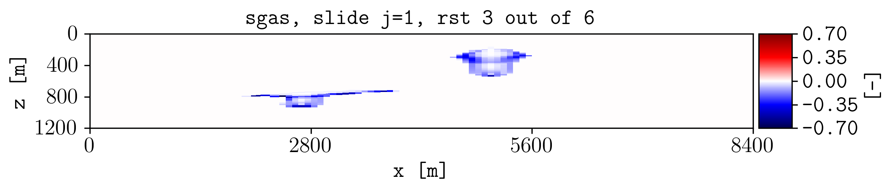
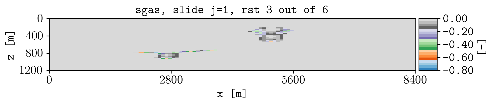
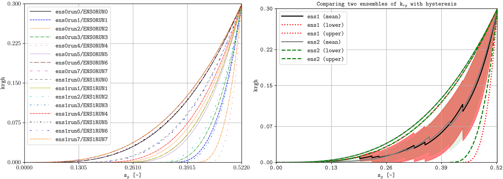

.. _example-ensembles:

Different inputs and ensembles
==============================

Compare simulation cases, calculate differences between models, and summarize
ensembles of related runs.

Prepare the comparison cases
----------------------------

This example uses two SPE11B simulations with different injection rates. The
base case is written to ``spe11b`` and the modified case to
``spe11b_larger_inj``. The maintained Bash script prepares and runs both cases
before generating the figures below.

Compare summary quantities
--------------------------

Pass several input cases to :option:`plopm -i` and separate plotted variables
with commas. The following command compares three related quantities:

.. code-block:: console

   plopm -i 'spe11b/SPE11B spe11b_larger_inj/SPE11B' -v 'fgmip,fgmip / 1E6,RGMDS:5' -yl '[kg]  [Kt]  [kg]' -tu w -fs 10,5 -c r,b -ls 'solid,dashed' -t 'Field gas mass in place  Converted to kilotonnes  Dissolved CO$_2$ in facies 5' -fz 14 -sg 2,2 -rdl 1 -ll empty,empty,empty,center -fn comparison

   Field gas mass in place, the same quantity converted to kilotonnes, and
   dissolved CO2 mass in facies 5 for the two simulations.

The command demonstrates that variable expressions can be entered directly in
:option:`plopm -v`. Here, ``fgmip / 1E6`` converts field gas mass in place from
kilograms to kilotonnes.

The remaining options control the comparison:

* :option:`plopm -yl` assigns a y-axis label to each quantity.
* :option:`plopm -tu` displays time in weeks.
* :option:`plopm -c` and :option:`plopm -ls` distinguish the two cases by
  color and line style.
* :option:`plopm -sg` arranges the three plots in a two-by-two layout.
* :option:`plopm -rdl` removes repeated subplot labels.
* :option:`plopm -ll` removes legends from the first three panels and places
  the shared legend in the remaining panel.

Subtract one case from another
------------------------------

Use :option:`plopm -di` to subtract a reference case from the primary input.
This command calculates the difference in gas saturation at restart step 3:

.. code-block:: console

   plopm -i spe11b_larger_inj/SPE11B -v sgas -r 3 -di spe11b/SPE11B -hide 0,0,0,1

   Gas saturation in the higher-injection case minus gas saturation in the
   base case.

The input selected with :option:`plopm -di` must provide the same variable and
a compatible grid. Positive values indicate a larger gas saturation in the
primary input; negative values indicate a larger value in the reference case.

Format the difference map
-------------------------

Customize the difference map with a colormap, fixed color limits, colorbar tick
count, number format, and output filename:

.. code-block:: console

   plopm -i spe11b_larger_inj/SPE11B -v sgas -r 3 -di spe11b/SPE11B -hide 0,0,0,1 -c tab20c_r -cl '[0,0.8]' -cbn 9 -cbf 0.1 -fn formated

   Formatted gas-saturation difference with a fixed color range and nine
   colorbar ticks.

Use :option:`plopm -cl` when several difference maps must use the same color
range. This makes the magnitudes directly comparable between figures.

Plot ensemble statistics
------------------------

Use :option:`plopm -ens` to summarize a collection of simulations. Ensemble
members are identified from the supplied input folders, and the selected mode
controls which statistical representation is plotted:

* ``-ens 0`` disables ensemble processing.
* ``-ens 1`` plots the ensemble mean with error bands.
* ``-ens 2`` plots the minimum, mean, and maximum.
* ``-ens 3`` combines both representations.

Use :option:`plopm -fb` with modes 1 and 3 to customize the fill colors and
alpha values of the error bands.

   Ensemble statistics generated from multiple related simulations.

The `ensemble example directory
<https://github.com/cssr-tools/plopm/tree/main/examples/ensemble>`_ contains
the supporting configuration and generation workflow. The maintained script
also demonstrates the available :option:`plopm -ens` modes.

Reproduce this example
----------------------

Run the complete workflow from the repository root:

.. code-block:: console

   . ./tests/scripts/docs_different_files_and_ensembles.sh

.. grid:: 1 2 2 2
   :gutter: 2

   .. grid-item::

      .. button-link:: https://github.com/cssr-tools/plopm/blob/main/tests/scripts/docs_different_files_and_ensembles.sh
         :color: primary
         :outline:
         :expand:

         View script

   .. grid-item::

      .. button-link:: https://raw.githubusercontent.com/cssr-tools/plopm/main/tests/scripts/docs_different_files_and_ensembles.sh
         :color: secondary
         :outline:
         :expand:

         View raw script

.. button-ref:: examples-gallery
   :ref-type: ref
   :color: primary
   :outline:

   Back to the examples gallery
