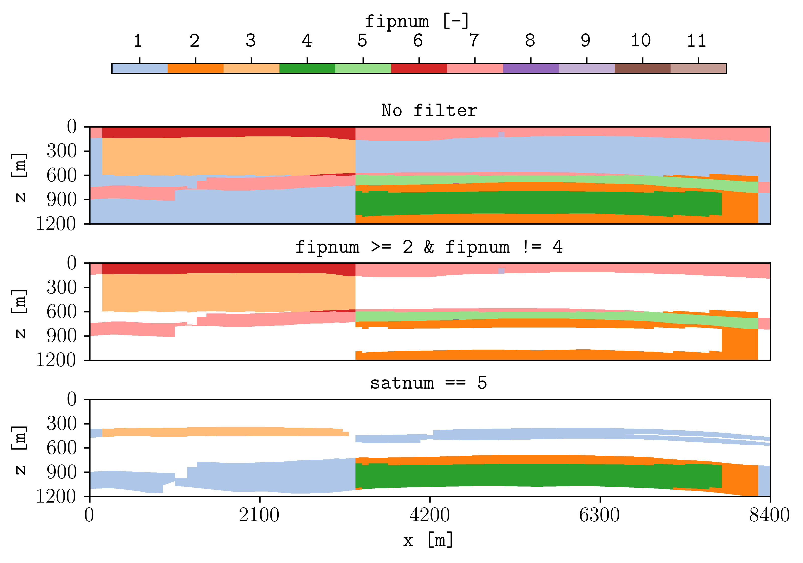

.. _example-filters:

Filters
=======

Select cells with conditions.

Join conditions for one input with ``&`` and separate input filters with commas.

.. code-block:: console

   plopm -i 'SPE11B SPE11B SPE11B' -flt ',fipnum >= 2 & fipnum != 4,satnum == 5' -v fipnum -sg 3,1 -rdl 1 -cbf .0f -fs 7,4 -cbp 0.15,0.97,0.7,0.02 -t 'No filter  fipnum >= 2 and fipnum != 4  satnum == 5' -st 0

Dynamic filters require ``RPORV`` in ``RPTRST``.

Reproduce this example
----------------------

Run the complete workflow from the repository root:

.. code-block:: console

   . ./tests/scripts/docs_filters.sh

.. grid:: 1 2 2 2
   :gutter: 2

   .. grid-item::

      .. button-link:: https://github.com/cssr-tools/plopm/blob/main/tests/scripts/docs_filters.sh
         :color: primary
         :outline:
         :expand:

         View script

   .. grid-item::

      .. button-link:: https://raw.githubusercontent.com/cssr-tools/plopm/main/tests/scripts/docs_filters.sh
         :color: secondary
         :outline:
         :expand:

         View raw script

.. button-ref:: examples-gallery
   :ref-type: ref
   :color: primary
   :outline:

   Back to the examples gallery
