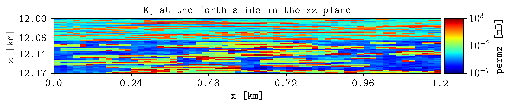
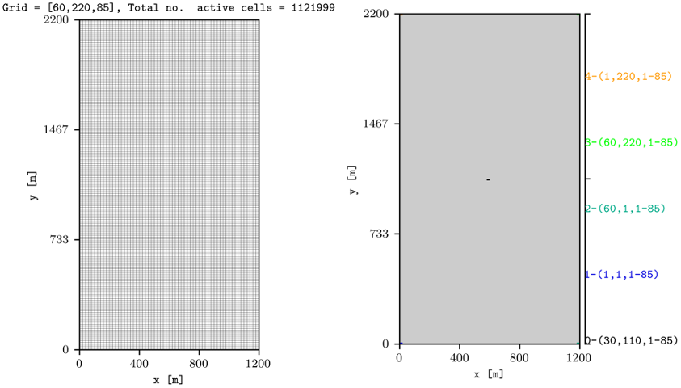

.. _example-generic-deck:

Generic deck
============

Plot a generic OPM Flow model.

Plot vertical permeability from SPE10 MODEL 2.

.. code-block:: console

   plopm -i SPE10_MODEL2 -v permz -s ,4, -clog 1 -xu km -yu km -xnt 6 -yf .2f -t 'K$_z$ at the fourth slice in the xz plane' -cl '[1e-7,1e3]'

Plot the grid and wells from above.

.. code-block:: console

   plopm -i SPE10_MODEL2 -s ,,1 -fs 3,4 -fz 8 -v grid -hide 0,0,1,0
   plopm -i SPE10_MODEL2 -s ,,1 -fs 3,4 -fz 8 -v wells -hide 0,0,0,1

Reproduce this example
----------------------

Run the complete workflow from the repository root:

.. code-block:: console

   . ./tests/scripts/docs_generic_deck.sh

.. grid:: 1 2 2 2
   :gutter: 2

   .. grid-item::

      .. button-link:: https://github.com/cssr-tools/plopm/blob/main/tests/scripts/docs_generic_deck.sh
         :color: primary
         :outline:
         :expand:

         View script

   .. grid-item::

      .. button-link:: https://raw.githubusercontent.com/cssr-tools/plopm/main/tests/scripts/docs_generic_deck.sh
         :color: secondary
         :outline:
         :expand:

         View raw script

.. button-ref:: examples-gallery
   :ref-type: ref
   :color: primary
   :outline:

   Back to the examples gallery
