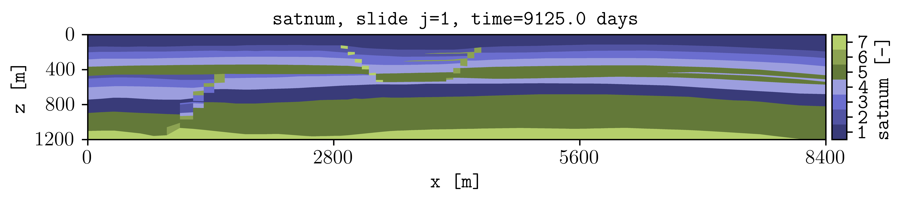
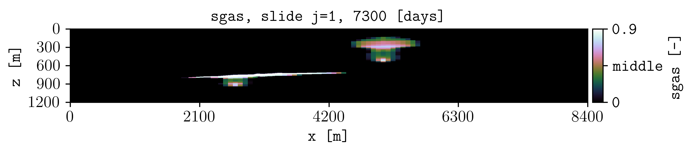
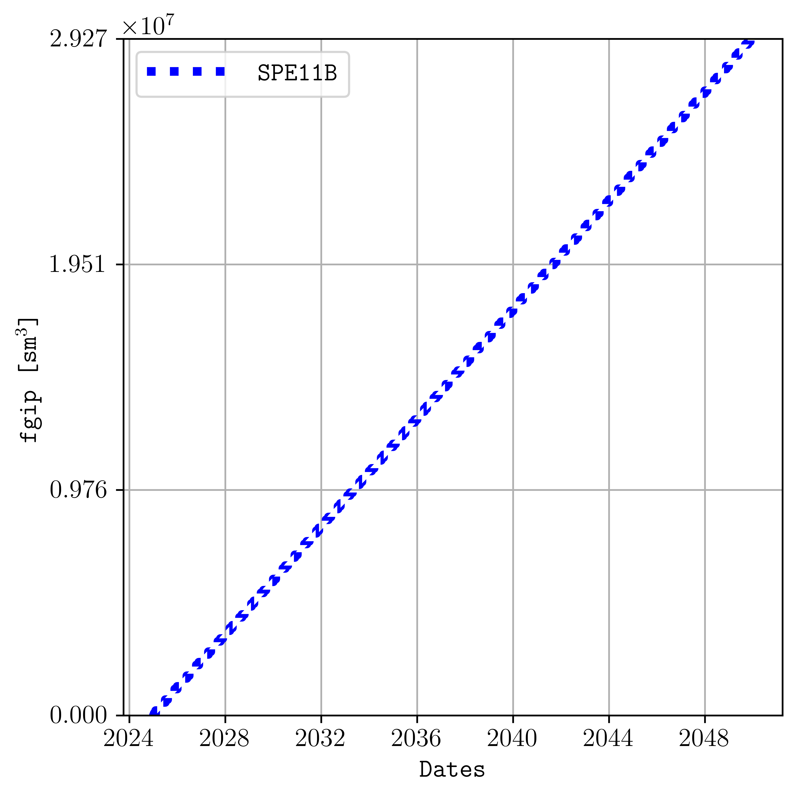
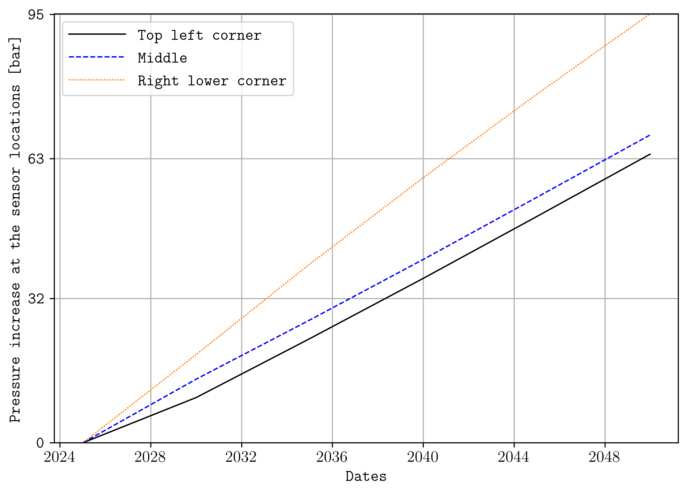

.. _example-hello-world:

Hello world
===========

Create maps, summary plots, and cell time series.

Run the default command from the ``examples`` directory.

.. code-block:: console

   plopm -i SPE11B

Plot gas saturation at restart step 4.

.. code-block:: console

   plopm -i SPE11B -v sgas -r 4 -cbn 3 -c cubehelix -cbt '[0, middle, 0.9]'

Plot field gas in place.

.. code-block:: console

   plopm -i SPE11B -v fgip -c b -ls dotted -fz 12 -fs 5,5 -lw 4 -tu dates

Plot pressure increase at three cells.

.. code-block:: console

   plopm -i 'SPE11B SPE11B SPE11B' -v 'pressure - 0pressure' -s '1,1,1 41,1,29 83,1,58' -llb 'Top left corner  Middle  Right lower corner' -yl 'Pressure increase at the sensor locations [bar]' -yf .0f -xnt 11 -tu dates

Reproduce this example
----------------------

Run the complete workflow from the repository root:

.. code-block:: console

   . ./tests/scripts/docs_hello_world.sh

.. grid:: 1 2 2 2
   :gutter: 2

   .. grid-item::

      .. button-link:: https://github.com/cssr-tools/plopm/blob/main/tests/scripts/docs_hello_world.sh
         :color: primary
         :outline:
         :expand:

         View script

   .. grid-item::

      .. button-link:: https://raw.githubusercontent.com/cssr-tools/plopm/main/tests/scripts/docs_hello_world.sh
         :color: secondary
         :outline:
         :expand:

         View raw script

.. button-ref:: examples-gallery
   :ref-type: ref
   :color: primary
   :outline:

   Back to the examples gallery
