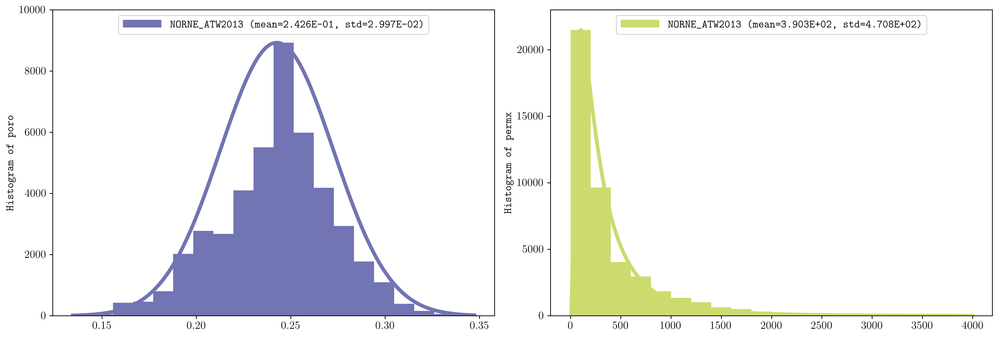

.. _example-histograms:

Histograms
==========

Plot property distributions.

Plot porosity and permeability histograms with fitted distributions.

.. code-block:: console

   plopm -i NORNE_ATW2013 -v poro,permx -hist '20,norm 20,lognorm' -ag 0 -sg 1,2 -fs 15,5 -ll 'upper center' -y '[0,10000] [0,23000]' -c '#7274b3,#cddb6e'

Reproduce this example
----------------------

Run the complete workflow from the repository root:

.. code-block:: console

   . ./tests/scripts/docs_histograms.sh

.. grid:: 1 2 2 2
   :gutter: 2

   .. grid-item::

      .. button-link:: https://github.com/cssr-tools/plopm/blob/main/tests/scripts/docs_histograms.sh
         :color: primary
         :outline:
         :expand:

         View script

   .. grid-item::

      .. button-link:: https://raw.githubusercontent.com/cssr-tools/plopm/main/tests/scripts/docs_histograms.sh
         :color: secondary
         :outline:
         :expand:

         View raw script

.. button-ref:: examples-gallery
   :ref-type: ref
   :color: primary
   :outline:

   Back to the examples gallery
