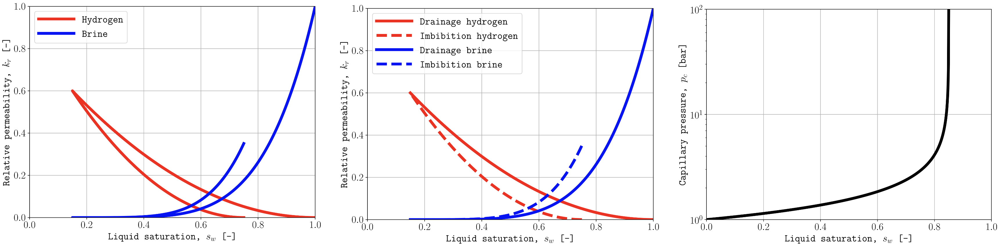

.. _example-relative-permeability:

Relative permeability and capillary pressure
============================================

Plot saturation functions.

Append a SATNUM table number or ``h`` for hysteresis curves.

.. code-block:: console

   plopm -i H2HYSTERESIS -v krgh,krwh -llb 'Hydrogen  Brine' -c r,#0314fc -x '[0,1]' -lw 5 -fz 18 -fs 8,6 -yl 'Relative permeability, $k_r$ [-]' -xl 'Liquid saturation, $s_w$ [-]' -ls solid,solid -xnt 6 -ynt 6
   plopm -i H2HYSTERESIS -v pcwg -c k -x '[0,1]' -lw 5 -ll empty -fz 18 -fs 8,6 -yl 'Capillary pressure, $p_c$ [bar]' -xl 'Liquid saturation, $s_w$ [-]' -xnt 6 -ylog 1

Reproduce this example
----------------------

Run the complete workflow from the repository root:

.. code-block:: console

   . ./tests/scripts/docs_rel_perms_and_capillary_pressure.sh

.. grid:: 1 2 2 2
   :gutter: 2

   .. grid-item::

      .. button-link:: https://github.com/cssr-tools/plopm/blob/main/tests/scripts/docs_rel_perms_and_capillary_pressure.sh
         :color: primary
         :outline:
         :expand:

         View script

   .. grid-item::

      .. button-link:: https://raw.githubusercontent.com/cssr-tools/plopm/main/tests/scripts/docs_rel_perms_and_capillary_pressure.sh
         :color: secondary
         :outline:
         :expand:

         View raw script

.. button-ref:: examples-gallery
   :ref-type: ref
   :color: primary
   :outline:

   Back to the examples gallery
