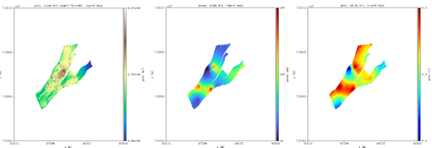
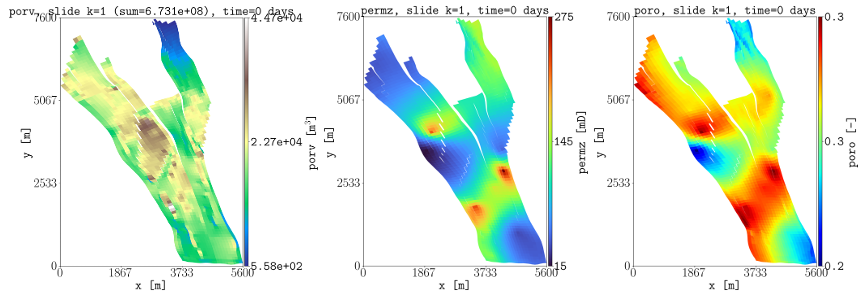
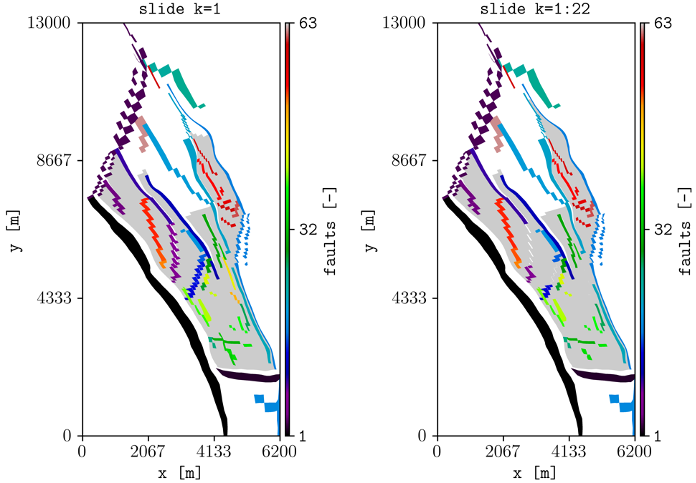
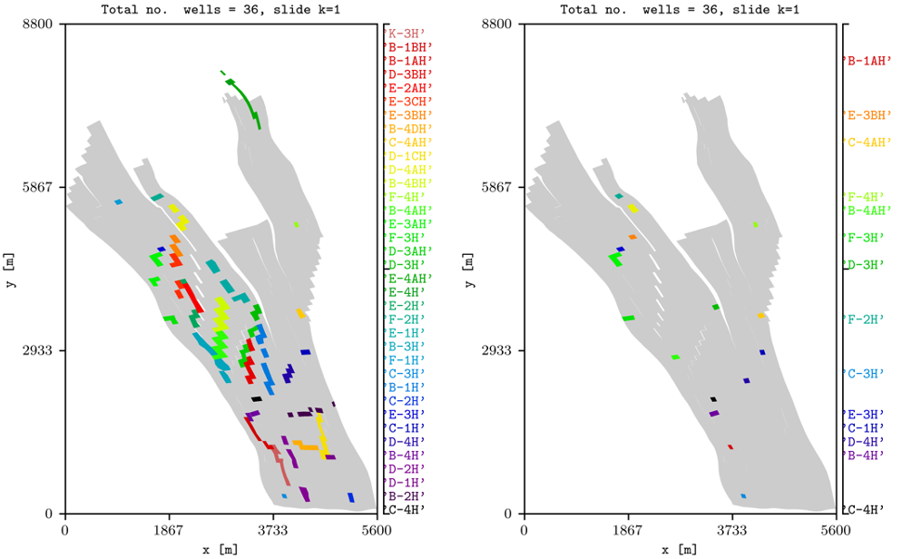

.. _example-transformations:

Rotation, translation, and zoom
===============================

Transform, crop, and inspect Norne.

Start with the Norne top view.

.. code-block:: console

   plopm -i NORNE_ATW2013 -s ,,1

Rotate, translate, and crop the grid.

.. code-block:: console

   plopm -i NORNE_ATW2013 -s ,,1 -rot 65 -tr '[6456335.5,-3476500]' -x '[0,5600]' -y '[0,7600]' -fz 8

Apply the same transformation to faults.

.. code-block:: console

   plopm -i NORNE_ATW2013 -v faults -s ,,1 -rot 65 -tr '[6456335.5,-3476500]' -x '[0,5600]' -y '[0,8800]' -fz 8 -gr 1
   plopm -i NORNE_ATW2013 -v faults -s ,,1:22 -rot 65 -tr '[6456335.5,-3476500]' -x '[0,5600]' -y '[0,8800]' -fz 8 -agg max

Plot all wells and wells on the selected layer.

.. code-block:: console

   plopm -i NORNE_ATW2013 -v wells -s ,,1 -rot 65 -tr '[6456335.5,-3476500]' -x '[0,5600]' -y '[0,8800]' -fz 8 -gr 1 -fn norne_wells_global
   plopm -i NORNE_ATW2013 -v wells -s ,,1 -rot 65 -tr '[6456335.5,-3476500]' -x '[0,5600]' -y '[0,8800]' -fz 8 -fn norne_wells

.. note::

   Faults and wells must be declared directly in the input deck.

Reproduce this example
----------------------

Run the complete workflow from the repository root:

.. code-block:: console

   . ./tests/scripts/docs_rotation_translation_zoom.sh

.. grid:: 1 2 2 2
   :gutter: 2

   .. grid-item::

      .. button-link:: https://github.com/cssr-tools/plopm/blob/main/tests/scripts/docs_rotation_translation_zoom.sh
         :color: primary
         :outline:
         :expand:

         View script

   .. grid-item::

      .. button-link:: https://raw.githubusercontent.com/cssr-tools/plopm/main/tests/scripts/docs_rotation_translation_zoom.sh
         :color: secondary
         :outline:
         :expand:

         View raw script

.. button-ref:: examples-gallery
   :ref-type: ref
   :color: primary
   :outline:

   Back to the examples gallery
