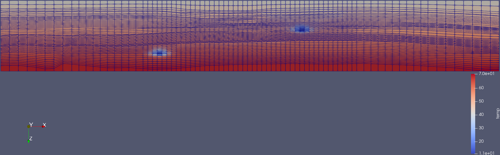

.. _example-vtk:

Convert to VTK
==============

Export data for `ParaView <https://www.paraview.org>`_.

Export selected variables for restart steps 0 and 5.

.. code-block:: console

   plopm -i SPE11B -v temp,fipnum,co2m,xco2l -vf Float32,UInt16,Float64,Float16 -r 0,5 -m vtk

   Grid and temperature after 25 years of CO2 injection, viewed in ParaView.

Reproduce this example
----------------------

Run the complete workflow from the repository root:

.. code-block:: console

   . ./tests/scripts/docs_convert_to_vtk.sh

.. grid:: 1 2 2 2
   :gutter: 2

   .. grid-item::

      .. button-link:: https://github.com/cssr-tools/plopm/blob/main/tests/scripts/docs_convert_to_vtk.sh
         :color: primary
         :outline:
         :expand:

         View script

   .. grid-item::

      .. button-link:: https://raw.githubusercontent.com/cssr-tools/plopm/main/tests/scripts/docs_convert_to_vtk.sh
         :color: secondary
         :outline:
         :expand:

         View raw script

.. button-ref:: examples-gallery
   :ref-type: ref
   :color: primary
   :outline:

   Back to the examples gallery
