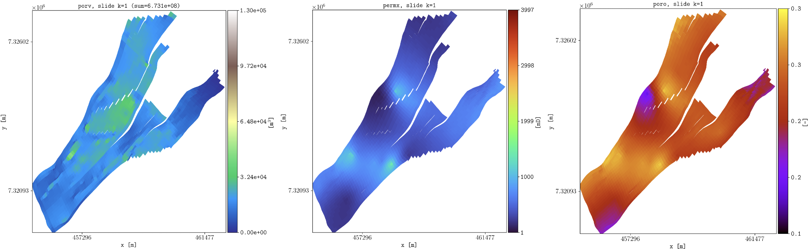

============
Introduction
============

This documentation describes the **plopm** tool hosted in `https://github.com/cssr-tools/plopm <https://github.com/cssr-tools/plopm>`_. 

Concept
-------
Simplified and flexible framework for quick visualization of `OPM Flow <https://opm-project.org>`_ geological models.
The approach is the generation of PNG figures from static (e.g, porosity, pore volume fluid in place numbers)
and dynamic (e.g., pressure, fluid saturations) properties given any 2D slide with the option to generate GIFs (e.g., the middle part of a reservoir in the xy plane),
as well as plotting any given summary vector (e.g., field gas in place a.k.a fgip). 

The **plopm** tool can be useful for quick inspection of geological models, as well as for generation of nice
figures for papers/presentations. Also, **plopm** can plot summary results from different simulation cases in the same figure (e.g., using subplots),
as well as the difference between given dynamic variables (e.g., pressure) for two different simulations cases. In addition, **plopm** can
convert OPM Flow output files to vtk, which allows to use other visualization/postprocessing tools (e.g., `paraview <https://www.paraview.org>`_). 

.. _overview:

Overview
--------
The current implementation supports the following executable with the argument options:

.. code-block:: bash

    plopm -i name(s)_of_input_file(s)

where 

-i    The base name (or full path) of the input files; if more than one is given, separate them by ' ' (e.g, 'SPE11B /home/user/SPE11B_TUNED') ('SPE11B' by default).
-o    The base name (or full path) of the output folder ('.' by default, i.e., the folder where plopm is executed).
-v    Specify the name of the variable to plot, e.g., 'pressure', in addition to special extensive quantities for the mass such as 'grid', 'wells', 'faults', 'pcfact', 'limipres', 'overpres', 'objepres', 'krw', 'krg', 'krow', 'krog', 'pcow', 'pcog', 'pcwg', 'gasm', 'dism', 'liqm', 'vapm', 'co2m', 'h2om', 'xco2l', 'xh2ov', 'xco2v', 'xh2ol', 'fwcdm', and 'fgipm', as well as operations, e.g, 'pressure - 0pressure' to plot the pressure increase ('poro,permx,permz,porv,fipnum,satnum' by default).
-m    Generate 'png', 'gif', 'csv', or 'vtk' files ('png' by default).
-s    The slide in the 3D model to plot the 2D maps, e.g, '10,,' to plot the xz plane on all cells with i=10, or ',,5:10' to plot the pv average weighted quantity. If two values are given, e.g., ':,5,7', then the variable is plotted along the colon entry given the indice at the specified restart step, unless the flag '-how ' is set, then this generates a plot of the projected variable over time. If the three values are given, e.g., '2,4,9', then the variable is plotted over time at that location (',1,' by default, i.e., the xz surface at j=1).
-p    Path to flow, e.g., '/home/build/bin/flow'. This is used to generate the grid for the vtk files ('flow' by default).
-z    Scale the axis in the 2D maps ('1' by default).
-f    The font size ('12' by default).
-x    Set the lower and upper bounds along x, e.g., '[-100,200]' ('' by default).
-y    Set the lower and upper bounds along y, e.g., '[-10,300]' ('' by default).
-c    Specify the colormap, e.g., 'jet', or color(s) for the summary, e.g., 'b,r' ('' by default, i.e., set by plopm).
-e    Specify the linestyles, e.g., 'solid,dotted' ('' by default, i.e., set by plopm).
-b    Specify the upper and lower bounds for the color map, e.g., '[-0.1,11]' ('' by default, i.e., set by plopm).
-d    Specify the dimensions in inches generated png, e.g., '8,16' ('7,5' by default).
-t    Specify the figure title, e.g., 'Final saturation map' ('' by default, i.e., set by plopm).
-r    Restart number to plot the dynamic variable, where 0 corresponds to the initial one ('-1' by default, i.e., the last restart file). For GIFs, the default correspond to all restart steps. To make a GIF using selected restart steps, provide these separated by commas, e.g., '0,3,10,20'.  To write a serie of PNGs, this can be achieve by setting '-r a:b:[step]', e.g., '-r 1:3' for rsts 1 to 3, and '-r 5:505:250' for rsts 5, 255, and 505.
-a    Scale the mass variable, e.g., 1e-9 for the color bar for the CO2 mass to be in Mt ('1' by default).
-csv        If the input file is a csv, then define the number of column for the x, y, and variable for spatial maps, or the t and variable for time series ('' by default, column numbering starting from 1, not 0).
-tunits     For the x axis in the summary use seconds 's', minutes 'm', hours 'h', days 'd', weeks 'w', years 'y', or dates 'dates' ('s' by default).
-ylabel     Text for the y axis ('' by default, i.e., set by plopm).
-xlabel     Text for the x axis ('' by default, i.e., set by plopm).
-ylnum      Number of y axis labels ('5' by default).
-xlnum      Number of x axis labels ('5' by default).
-cnum       Number of color labels ('' by default, i.e., set by plopm).
-xlog       Use log scale for the x axis ('0' by default).
-ylog       Use log scale for the y axis ('0' by default).
-clabel     Text for the colorbar ('' by default, i.e., set by plopm).
-labels     Legend in the summary plot, separated by commas if more than one ('' by default, i.e., set by plopm).
-axgrid     Set axis.grid to True for the summary plots ('1' by default).
-dpi        Dots per inch for the figure ('500' by default).
-xformat    Format for the x numbers, e.g., .2e for exponential notation ('' by default, i.e., set by plopm).
-yformat    Format for the y numbers, e.g., .1f for one decimal ('' by default, i.e., set by plopm).
-cformat    Specify the format for the numbers in the colormap, e.g., .2f for two decimals ('' by default, i.e., set by plopm).
-cticks     Set the colorbar tick labelling, e.g., '[G, F, E, D, C, ESF]' ('' by default).
-xunits     For the x axis in the spatial maps meters 'm', kilometers 'km', centimeters 'cm', or milimeters 'mm' ('m' by default).
-yunits     For the y axis in the spatial maps meters 'm', kilometers 'km', centimeters 'cm', or milimeters 'mm' ('m' by default).
-remove     Set the entries to 1 to remove in the spatial maps the left axis, bottom axis, colorbar, and title ('0,0,0,0' by default).
-facecolor  Color outside the spatial map ('w' by default, i.e., white).
-save       Name of the output files ('' by default, i.e., set by plopm).
-log        Log scale for the color map ('0' by default).
-clogthks   Set the thicks for the color maps with log scale, e.g., '[1,2,3]' ('' by default).
-rotate     Grades to rotate the grid in the 2D maps ('0' by default).
-translate  Translate the grid in the 2D maps x,y directions ('[0,0]' by default).
-global     Min and max in the colorbars from the current 2D slide values (0) or whole 3D model '1' ('0' by default).
-ensemble   Set to '1' to plot the mean and error bands for the ensemble, '2' to plot the min, mean, and max values, and '3' to plot '1' and '2' ('0' by default).
-bandprop   Set to color and alpha values for the matplotlib.pyplot.fill_between function when the flag -ensamble is used with values '1' or '3' , e.g., -bandprop 'r,0.1,g,0.2' ('' by default, i.e., set as the same color as the mean and alpha==0.2).
-how        Select how to project the given variable (-v) in a slide range (-s). By default the variables are pore volume weighted averaged along the range except for mass quantities, porv, trans, and cell dims (e.g., dz) which are summed; cell indices (e.g., index_i) which show the discrete value; harmonic average and arithmetic average for permeabilities depending on the slide range direction using the cell dim along the slide (e.g., -s ,,1:2 -v permz [harmonic averaged]); for wells/faults, 'min' show the cells when at least one cell contains them or 'max' when all cells are part of the given slide/slides range. The supported options are 'min', 'max', 'sum', 'mean', 'pvmean', 'harmonic', 'arithmetic', 'first', and 'last' ('' by default, i.e., the defaults as described above).
-ncolor     Color for the inactive cells in the 2D maps ('w' by default, i.e., white).
-lw         Line width separated by commas if more than one ('1' by default).
-subfigs    Generate separated or a single Figure (e.g., '2,2' for four subfigures) ('' by default, i.e., separate figures).
-loc        Location of the legend by passing the value to matplotlib.pyplot.legend; set to 'empty' to remove it ('best' by default).
-delax      Delete aligned axis labels in subfigures ('0' by default).
-printv     Print the avaiable variables to plot ('0' by default).
-vtkformat  Format for each variable in the vtks, support for Float64, Float32, and UInt16 ('Float64' by default).
-vtknames   Label each variable in the written vtk ('' by default, i.e., the names given in the -v argument).
-mask       Static variable to use as 2D map background ('' by default).
-diff       The base name (or full path) of the input file to substract ('' by default).
-suptitle   Title for the subfigures ('' by default, i.e., set by plopm, if 0, then it is removed; otherwise, write the text).
-cbsfax     Set the global axis position and size for the colorbar ('0.40,0.01,0.2,0.02' by default).
-grid       Set the edgecolors and lw in the matplotlib.pyplot.pcolormesh method, e.g., 'black,1e-3' ('' by default, i.e., no grid).
-vmin       Set a minimum threshold to remove values in the variable ('' by default).
-vmax       Set a maximum threshold to remove values in the variable ('' by default).
-distance   Compute the 'min' or 'max' distance of the variable to a 'sensor' using -s, or to the lateral boundaries ('border'), e.g., '-s 1,2,3 -v 'sgas > 1e-2' -distance max,sensor' computes the maximum distance to the location using a min threshold of 1e-2 to indicate if a cell has gas or not ('' by default).
-histogram  Plot the histogram of the given variable with the given number of bins and distribution, e.g., '20,norm' for 20 bins and normal distribution ('' by default, i.e., no histogram; norm and lognorm supported for now, if no specified then only the histogram is plotted).
-stress     Value for the stress coeff in the computation of the pressure limit for the variables related to the caprock integrity: limipres, overpres, and objepres ('0.134' by default).
-maskthr    Set the threshold for the variable to mask " "('1e-3' by default).
-filter     Consider only the cells fullfilling the conditions, which are separated by '&', and use ',' for different input files e.g., 'fluxnum == 2 & sgas >= 0.2, satnum != 5'. ('' by default; note that RPORV needs to be set in RPTRST to be able to use dynamic filter variables such as sgas).
-interval   Time for the frames in the GIF in milli second ('1000' by default).
-loop       Set to 1 for infinity loop in the GIF ('0' by default).
-warnings   Set to 1 to print warnings ('0' by default).
 
.. tip::

    Type in the terminal **plopm -h** to show these argument options.
