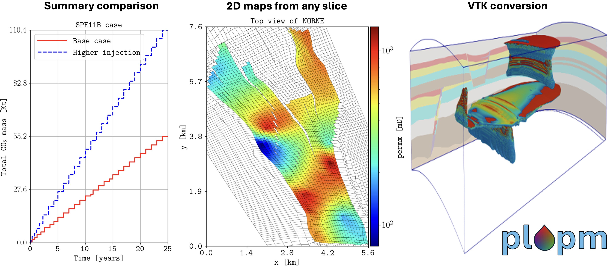

============
Introduction
============

This documentation describes the **plopm** tool hosted in `https://github.com/cssr-tools/plopm <https://github.com/cssr-tools/plopm>`_. 

Concept
+++++++
Simplified and flexible framework for quick visualization of `OPM Flow <https://opm-project.org>`_ geological models.
The approach is the generation of PNG figures from static (e.g, porosity, pore volume fluid in place numbers)
and dynamic (e.g., pressure, fluid saturations) properties given any 2D slide with the option to generate GIFs (e.g., the middle part of a reservoir in the xy plane),
as well as plotting any given summary vector (e.g., field gas in place a.k.a fgip). 

The **plopm** tool can be useful for quick inspection of geological models, as well as for generation of nice
figures for papers/presentations. Also, **plopm** can plot summary results from different simulation cases in the same figure (e.g., using subplots),
as well as the difference between given dynamic variables (e.g., pressure) for two different simulations cases. In addition, **plopm** can
convert OPM Flow output files to vtk, which allows to use other visualization/postprocessing tools (e.g., `paraview <https://www.paraview.org>`_). 

.. _overview:

Command-line interface
++++++++++++++++++++++

plopm provides command-line options for selecting input data, configuring
plots, and controlling output. Run the following command to display the
available options and their default values:

.. code-block:: console

   plopm -h

Basic usage
-----------

The general command structure is:

.. code-block:: console

   plopm [options]

.. tip::

   The options have both a short and a long name. For example, ``-v`` and
   ``--variable`` refer to the same option:

   .. code-block:: console

      plopm -v pressure
      plopm --variable pressure

   The short form is convenient for interactive use, while the long form can
   make scripts and saved commands easier to understand. The examples in this
   documentation use the short forms.

For example, the following command plots pressure and gas saturation from
``SPE11B`` at the last restart step:

.. code-block:: console

   plopm -i SPE11B -v "pressure,sgas" -r -1

Options may be combined to configure the data selection, plot appearance,
and output. For example:

.. code-block:: console

   plopm -i SPE11B -v pressure -s ",,5" -c viridis -cl "[100,300]" -o results -fn pressure_k5

Argument syntax
---------------

Many plopm options accept multiple values or specifications. Commas normally
separate components within one specification, while spaces separate repeated
specifications for different inputs, variables, or plots. Enclose the complete
argument in quotes when it contains spaces.

For example:

.. code-block:: console

   plopm -v "pressure,sgas"
   plopm -s "1,1,1 41,1,29 83,1,58"
   plopm -y "[0,10000] [0,23000]"
   plopm -hist "50,norm 20,lognorm 100"
   plopm -clog "1,1,0"

The separators have the following general meanings:

* **Commas** separate components within one specification, such as
  ``2,4,9``, ``0,2,5``, or ``[100,-50]``.
* **Single spaces** separate repeated specifications, such as
  ``1,1,1 41,1,29 83,1,58`` or ``[0,10000] [0,23000]``.
* **Two spaces** separate free-text labels or titles when each value may
  contain spaces, such as ``Reference case  Modified case``.
* **Semicolons** separate CSV column specifications for different inputs.
  An empty specification skips the corresponding input, such as ``;1,2,5``.
* **Ampersands (``&``)** join filter conditions for the same input.
* **Commas in ``-flt``** separate filter specifications for different
  inputs.
* **Empty entries** act as placeholders when an option applies only to
  selected inputs.

For example:

.. code-block:: console

   plopm -llb "Reference case  Modified case"
   plopm -flt "fluxnum == 2 & sgas >= 0.2, satnum != 5"
   plopm -i "table model" -v ",BWPR:256,1,5" -cc "1,3;"

Option reference
----------------

The options are grouped by purpose. Default values are also displayed by
``plopm --help``.

.. note::

   Legacy option names from earlier plopm releases remain available for
   backward compatibility. The documentation uses the preferred option names.

Input and data selection
~~~~~~~~~~~~~~~~~~~~~~~~

``-i``, ``--input``
   Base name or full path of the input. Separate multiple inputs with spaces,
   e.g., ``SPE11B /home/user/SPE11B_TUNED`` (``SPE11B`` by default).

``-v``, ``--variable``
   Variable specification(s) to plot. Separate variables with commas, e.g.,
   ``pressure,sgas``.

   An empty entry may be used as a placeholder when the corresponding input
   is configured through ``-cc``, e.g.:

   .. code-block:: console

      plopm -v ",BWPR:256,1,5" -cc "1,3;"

   Special variables include ``grid``, ``wells``, ``faults``, ``pcfact``,
   ``limipres``, ``overpres``, ``objepres``, ``krw``, ``krg``, ``krow``,
   ``krog``, ``pcow``, ``pcog``, ``pcwg``, ``gasm``, ``dism``, ``liqm``,
   ``vapm``, ``co2m``, ``h2om``, ``xco2l``, ``xh2ov``, ``xco2v``,
   ``xh2ol``, ``fwcdm``, and ``fgipm``.

   The default is
   ``poro,permx,permz,porv,fipnum,satnum``.

``-r``, ``--restart``
   Restart step(s), where ``0`` is the initial state and ``-1`` is the last.
   Separate selected steps with commas, e.g., ``0,2`` or ``0,3,10,20``, or
   use ``start:end[:step]``, e.g., ``1:3``, ``0:4:2``, or ``5:505:250``.

   The default is ``-1``. GIF output uses all available steps by default.

``-cc``, ``--csv-columns``
   CSV column indices, starting at 1. Use ``t,value`` for a time series or
   ``x,y,value`` for a spatial map.

   Separate specifications for different inputs with semicolons. An empty
   specification skips the corresponding input, e.g., ``;1,2,5`` or
   ``1,3;`` (empty by default).

``-fp``, ``--flow-path``
   Path or command for the Flow executable, e.g.,
   ``/home/build/bin/flow``. Used only to generate the grid for VTK output
   (``flow`` by default).

Output options
~~~~~~~~~~~~~~

``-m``, ``--format``
   Output format: ``png``, ``gif``, ``csv``, or ``vtk``
   (``png`` by default).

``-o``, ``--output-dir``
   Base name or full path of the output directory. The default is ``.``,
   meaning the directory where plopm is executed.

``-fn``, ``--filename``
   Output file name. The default is empty, meaning that the name is set by
   plopm.

Spatial and temporal selection
~~~~~~~~~~~~~~~~~~~~~~~~~~~~~~

``-s``, ``--slice``
   Spatial selection in ``i,j,k`` form. An empty entry selects a plane, e.g.,
   ``10,,``; a range projects over cells, e.g., ``,,5:10``; ``:`` selects a
   line, e.g., ``:,5,7``; and three indices select a cell over time, e.g.,
   ``2,4,9``.

   Separate multiple selections with spaces, e.g.:

   .. code-block:: console

      plopm -s "1,1,1 41,1,29 83,1,58"

   The default is ``,1,``.

``-tu``, ``--time-units``
   Summary-plot x-axis time units: ``s``, ``m``, ``h``, ``d``, ``w``, ``y``,
   ``dates``, ``empty``, or ``tstep`` (``d`` by default).

``-dist``, ``--distance``
   Compute the minimum or maximum distance to a sensor or lateral border.
   Supported specifications are ``min,sensor``, ``max,sensor``,
   ``min,border``, and ``max,border``.

   For a sensor, provide its ``i,j,k`` location with ``-s``, e.g.:

   .. code-block:: console

      plopm -s 1,2,3 -v "sgas > 1e-2" -dist max,sensor

   The default is empty, meaning that no distance is computed.

Filtering, masking, and thresholds
~~~~~~~~~~~~~~~~~~~~~~~~~~~~~~~~~~

``-flt``, ``--filter``
   Cell-selection conditions. Join conditions for one input with ``&`` and
   separate filters for different inputs with commas, e.g.:

   .. code-block:: console

      plopm -flt "fluxnum == 2 & sgas >= 0.2, satnum != 5"

   The default is empty. Dynamic variables such as ``sgas`` require ``RPORV``
   in ``RPTRST``.

``-vmin``, ``--min-threshold``
   Minimum threshold used to remove variable values (empty by default).

``-vmax``, ``--max-threshold``
   Maximum threshold used to remove variable values (empty by default).

``-mv``, ``--mask-variable``
   Static variable used as the background of a 2D map (empty by default).

``-mt``, ``--mask-threshold``
   Threshold applied to the variable supplied through ``-mv``
   (``1e-3`` by default).

Computation and data transformation
~~~~~~~~~~~~~~~~~~~~~~~~~~~~~~~~~~~

``-agg``, ``--aggregation``
   Aggregation or selection method for 2D slices and projections. Supported
   values are ``min``, ``max``, ``sum``, ``mean``, ``pvmean``, ``harmonic``,
   ``arithmetic``, ``first``, and ``last``.

   Separate methods for multiple variables or plots with commas, e.g.:

   .. code-block:: console

      plopm -agg "first,arithmetic,max"

   By default, continuous variables are pore-volume weighted, extensive
   quantities are summed, indices retain discrete values, and permeabilities
   use directional harmonic or arithmetic averaging.

   For wells and faults, ``min`` shows cells containing at least one
   occurrence, while ``max`` requires all projected cells to contain one.
   The default is empty, meaning that the method is selected automatically.

``-sf``, ``--scale-factor``
   Multiplicative scaling factor applied to variable values, e.g., ``1e-9``
   to display CO2 mass in Mt.

   Separate factors for multiple variables or plots with commas, e.g.,
   ``1e-5,1`` (``1`` by default).

``-di``, ``--difference-input``
   Base name or full path of the input model to subtract from the primary
   input (empty by default).

``-sc``, ``--stress-coefficient``
   Stress coefficient used to compute pressure limits for ``limipres``,
   ``overpres``, and ``objepres`` (``0.134`` by default).

``-dg``, ``--dual-grid``
   Enable dual-grid processing using ``0`` or ``1`` (``0`` by default).

Plot types and statistical representation
~~~~~~~~~~~~~~~~~~~~~~~~~~~~~~~~~~~~~~~~~

``-hist``, ``--histogram``
   Histogram bins and optional distribution, e.g., ``20``, ``20,norm``, or
   ``20,lognorm``.

   Separate specifications for multiple plots with spaces, e.g.:

   .. code-block:: console

      plopm -hist "50,norm 20,lognorm 100"

   The default is empty, meaning that no histogram is plotted.

``-ens``, ``--ensemble``
   Ensemble plotting mode:

   * ``0`` disables ensemble plotting.
   * ``1`` plots the mean and error bands.
   * ``2`` plots the minimum, mean, and maximum.
   * ``3`` plots both representations.

   The default is ``0``.

``-fb``, ``--fill-between-style``
   Fill colors and alpha values used for ensemble error bands, supplied as
   comma-separated pairs, e.g., ``r,0.1,g,0.2``.

   This option is used with ``-ens 1`` or ``-ens 3``. The default is empty,
   meaning that the mean color is used with an alpha value of ``0.2``.

``-sp``, ``--step-plot``
   Use ``ax.step`` instead of ``ax.plot``: ``0`` or ``1``
   (``0`` by default).

Figure and subplot layout
~~~~~~~~~~~~~~~~~~~~~~~~~

``-fs``, ``--figsize``
   Figure width and height in inches, separated by a comma, e.g., ``8,16``
   (``7,5`` by default).

``-sg``, ``--subplot-grid``
   Number of subplot rows and columns, separated by a comma, e.g., ``2,2``
   for four subplots.

   The default is empty, meaning that separate figures are created.

``-cbp``, ``--colorbar-position``
   Global colorbar position and size as ``left,bottom,width,height``, e.g.,
   ``0.1,0.95,0.8,0.02``.

   Use ``empty`` to remove the global colorbar. The default is
   ``0.2,0.01,0.6,0.02``.

``-rdl``, ``--remove-duplicate-labels``
   Remove duplicated axis labels in subplot layouts using ``0`` or ``1``
   (``0`` by default).

Titles, labels, and legends
~~~~~~~~~~~~~~~~~~~~~~~~~~~

``-t``, ``--title``
   Figure title. Separate titles for multiple plots with two spaces
   (``0`` by default).

   For example:

   .. code-block:: console

      plopm -t "Reference case  Modified case"

``-st``, ``--suptitle``
   Title for a group of subplots. Use ``0`` to remove it. The default is
   empty, meaning that the title is set by plopm.

``-xl``, ``--xlabel``
   X-axis label. Separate labels for multiple plots with two spaces. The
   default is empty, meaning that labels are set by plopm.

``-yl``, ``--ylabel``
   Y-axis label. Separate labels for multiple plots with two spaces. The
   default is empty, meaning that labels are set by plopm.

``-cbl``, ``--colorbar-label``
   Colorbar label. Separate labels for multiple plots with two spaces. The
   default is empty, meaning that labels are set by plopm.

``-llb``, ``--legend-labels``
   Summary-plot legend labels. Separate labels with two spaces, e.g.:

   .. code-block:: console

      plopm -llb "Reference case  Modified case"

   The default is empty, meaning that labels are set by plopm.

``-ll``, ``--legend-location``
   Legend location passed to ``matplotlib.pyplot.legend``. Supported values
   are ``best``, ``upper right``, ``upper left``, ``lower left``,
   ``lower right``, ``right``, ``center left``, ``center right``,
   ``lower center``, ``upper center``, and ``center``.

   Use ``empty`` to remove the legend (``best`` by default).

``-hide``, ``--hide-map-elements``
   Hide the left axis, bottom axis, colorbar, and title using four
   comma-separated values of ``0`` or ``1``, in that order.

   For example, ``1,0,1,0`` hides the left axis and colorbar while retaining
   the bottom axis and title. The default is ``0,0,0,0``.

Axes, coordinates, and formatting
~~~~~~~~~~~~~~~~~~~~~~~~~~~~~~~~~

``-x``, ``--xlim``
   X-axis limits in the requested display order, e.g., ``[-100,200]`` or
   ``[200,-100]``.

   Separate limits for multiple plots with spaces, e.g.:

   .. code-block:: console

      plopm -x "[-100,200] [500,0]"

   The default is empty.

``-y``, ``--ylim``
   Y-axis limits in the requested display order, e.g., ``[0,70]`` or
   ``[70,0]``.

   Separate limits for multiple plots with spaces, e.g.:

   .. code-block:: console

      plopm -y "[0,10000] [0,23000]"

   The default is empty.

``-xu``, ``--xunits``
   Spatial-map x-axis units: ``mm``, ``cm``, ``m``, or ``km``
   (``m`` by default).

``-yu``, ``--yunits``
   Spatial-map y-axis units: ``mm``, ``cm``, ``m``, or ``km``
   (``m`` by default).

``-asp``, ``--equal-aspect``
   Scale the axes equally in 2D maps using ``0`` or ``1``
   (``1`` by default).

``-rot``, ``--rotation``
   Grid rotation angle in degrees for 2D maps (``0`` by default).

``-tr``, ``--translation``
   Grid translation in the x and y directions, e.g., ``[100,-50]``
   (``[0,0]`` by default).

``-xlog``, ``--xlog``
   Enable the logarithmic x-axis using ``0`` or ``1``.

   Comma-separated settings are accepted when different plots require
   different values (``0`` by default).

``-ylog``, ``--ylog``
   Enable the logarithmic y-axis using ``0`` or ``1``.

   Comma-separated settings are accepted when different plots require
   different values (``0`` by default).

``-xf``, ``--xformat``
   X-axis number format, e.g., ``.2e``. The default is empty, meaning that
   the format is set by plopm.

``-yf``, ``--yformat``
   Y-axis number format, e.g., ``.1f``. The default is empty, meaning that
   the format is set by plopm.

``-xnt``, ``--xtick-count``
   Number of x-axis ticks (``5`` by default).

``-ynt``, ``--ytick-count``
   Number of y-axis ticks (``5`` by default).

Color scales and styling
~~~~~~~~~~~~~~~~~~~~~~~~

``-c``, ``--colors``
   Colormap for spatial plots, e.g., ``jet``, or summary-plot colors
   separated by commas, e.g., ``b,r``.

   The default is empty, meaning that colors are selected by plopm.

``-cl``, ``--clim``
   Color-scale limits in the requested display order, e.g., ``[-0.1,11]`` or
   ``[11,-0.1]``.

   Separate limits for multiple plots with spaces. The default is empty.

``-clog``, ``--color-log``
   Enable logarithmic color scaling using ``0`` or ``1``.

   Separate settings for multiple variables with commas, e.g.:

   .. code-block:: console

      plopm -clog "1,1,0"

   The default is ``0``.

``-clt``, ``--color-log-ticks``
   Tick values for logarithmic color scales, enclosed by brackets and
   separated by commas, e.g., ``[1,10,100]``.

   At least one corresponding ``-clog`` setting must be ``1``. The default
   is empty.

``-gr``, ``--global-range``
   Use the value range of the current slice or the entire 3D model for color
   scaling:

   * ``0`` uses the current slice range.
   * ``1`` uses the whole-model range.

   The default is ``0``.

``-cbf``, ``--colorbar-format``
   Colorbar number format, e.g., ``.2f``. The default is empty, meaning that
   the format is set by plopm.

``-cbn``, ``--colorbar-tick-count``
   Number of colorbar ticks. Separate values for multiple plots with commas,
   e.g., ``3,6,2``.

   The default is empty, meaning that the number of ticks is set by plopm.

``-cbt``, ``--colorbar-ticks``
   Custom colorbar tick labels enclosed by brackets and separated by commas,
   e.g., ``[G,F,E,D,C,ESF]`` (empty by default).

``-lw``, ``--linewidth``
   Line widths separated by commas, e.g., ``1,2,1.5``. The default is empty,
   meaning that line widths are set by plopm.

``-ls``, ``--linestyle``
   Line styles separated by commas, e.g., ``solid,dotted``. The default is
   empty, meaning that line styles are set by plopm.

``-ag``, ``--axis-grid``
   Display the summary-plot axis grid using ``0`` or ``1``
   (``1`` by default).

``-fc``, ``--facecolor``
   Color outside the spatial map (``w`` by default, meaning white).

``-ic``, ``--inactive-color``
   Color for inactive cells in 2D maps
   (``w`` by default, meaning white).

``-ge``, ``--grid-edges``
   ``pcolormesh`` edge color and line width separated by a comma, e.g.,
   ``black,1e-3``.

   The default is empty, meaning that cell edges are not displayed.

``-fz``, ``--fontsize``
   Font size (``12`` by default).

``-dpi``, ``--dpi``
   Figure resolution in dots per inch (``500`` by default).

VTK output
~~~~~~~~~~

The following options apply only when ``-m vtk`` is selected.

``-vf``, ``--vtk-format``
   VTK data type for each variable. Supported formats are ``Float64``,
   ``Float32``, ``Float16``, ``Int64``, ``UInt64``, ``Int32``, ``UInt32``,
   ``Int16``, ``UInt16``, ``Int8``, and ``UInt8``.

   Separate formats for multiple variables with commas
   (``Float64`` by default).

``-vn``, ``--vtk-names``
   Custom VTK variable names separated by commas. The default is empty,
   meaning that the names supplied through ``-v`` are used.

GIF output
~~~~~~~~~~

The following options apply only when ``-m gif`` is selected.

``-gi``, ``--gif-interval``
   GIF frame interval in milliseconds (``1000`` by default).

``-gl``, ``--gif-loop``
   Loop GIF animations indefinitely using ``0`` or ``1``
   (``0`` by default).

Information and diagnostics
~~~~~~~~~~~~~~~~~~~~~~~~~~~

``-lv``, ``--list-variables``
   Print the available variables using ``0`` or ``1`` (``0`` by default).
