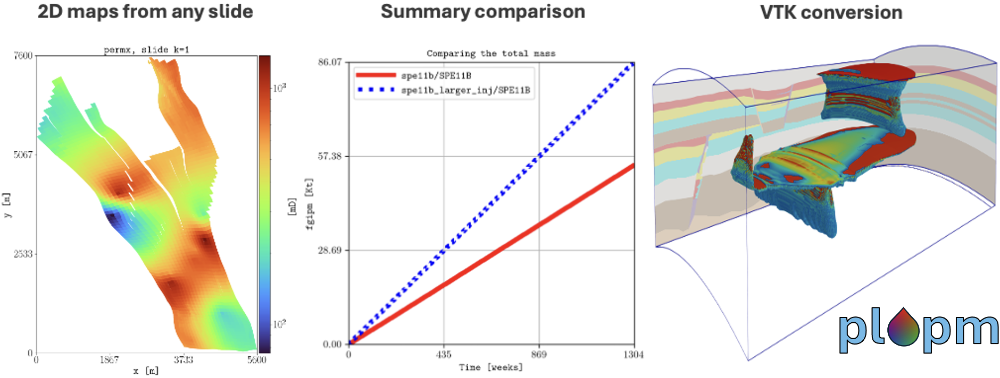

============
Introduction
============

This documentation describes the content of the **plopm** tool. 

Concept
-------
Simplified and flexible framework for quick visualization of OPM Flow geological models.
The approach is the generation of PNG figures from static (e.g, porosity, pore volume fluid in place numbers)
and dynamic (e.g., pressure, fluid saturations) properties given any 2D slide (e.g., the middle part of a reservoir in the xy plane),
as well as plotting any given summary vector (e.g., field gas in place a.k.a fgip). 

The **plopm** tool can be useful for quick inspection of geological models, as well as for generation of nice
figures for papers/presentations. 

.. _overview:

Overview
--------
The current implementation supports the following executable with the argument options:

.. code-block:: bash

    plopm -i some_input -o some_output_folder

where 

- \-i: The base name of the input deck and output files (`SPE11B` by default).
- \-o: The base name of the output folder (`output` by default).
- \-f: The font size (`14` by default).
- \-s: The slide for the 2D maps of the static variables, e.g, `10,,` to plot the xz plane on all cells with i=10 (`,1,` by default, i.e., the xz surface at j=1).
- \-x: Option to set the lower and upper bounds in the 2D map along x ('' by default).
- \-y: Option to set the lower and upper bounds in the 2D map along y ('' by default).
- \-z: The option to scale the axis in the 2d maps (`yes` by default).
- \-u: Use resdata or opm Python libraries (`resdata` by default).
- \-v: Specify the name of the static vairable to plot (e.g., `depth`) ('' by default, i.e., plotting: porv, permx, permz, poro, fipnum, and satnum).
- \-c: Specify the colormap (e.g., `jet`) (' by default, i.e., set by plopm).
- \-n: Specify the format for the numbers in the colormap (e.g., "lambda x, _: f'{x:.0f}'") ('' by default, i.e., set by plopm).
- \-l: Specify the units (e.g., \"[m\\$^2\\$]\") (`` by default, i.e., set by plopm).
- \-r: Restart number to plot the dynamic variable, where 1 corresponds to the initial one ('-1' by default, i.e., the last restart file).
- \-w: Plot the xz-position of the wells or sources ('0' by default).

Installation
------------
See the `Github page <https://github.com/cssr-tools/plopm>`_.

.. tip::
    Check the `CI.yml <https://github.com/cssr-tools/plopm/blob/main/.github/workflows/CI.yml>`_ file.

Getting started
---------------
See the :doc:`examples <./examples>`.

.. tip::
    Check the `tests <https://github.com/cssr-tools/plopm/blob/main/tests>`_.