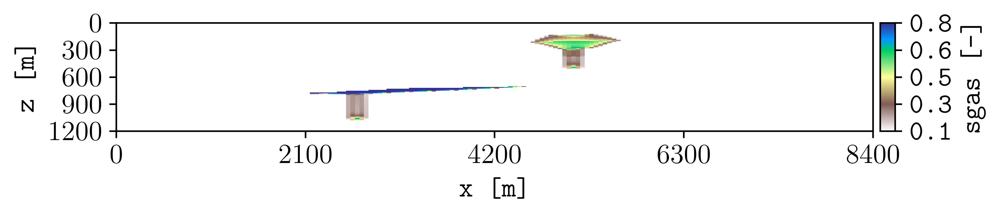

.. _tutorial-appearance:

Improve figure appearance
=========================

Set a clear output location and consistent visual styling.

Command
-------

.. code-block:: console

   plopm -i examples/SPE11C -o output -fn sgas_beautiful -v sgas -s ,14, -c terrain_r -fz 14 -dpi 500 -cl "[0.1,0.8]" -cbn 5 -hide 0,0,0,1

Result
------

How it works
------------

:option:`plopm -o` and :option:`plopm -fn`
   Set the output directory and filename.

:option:`plopm -c` and :option:`plopm -cl`
   Set the colormap and color limits.

:option:`plopm -fz` and :option:`plopm -dpi`
   Set the font size and output resolution.

:option:`plopm -cbn` and :option:`plopm -hide`
   Set the number of colorbar labels and hide the title.

Try this
--------

Use :option:`plopm -x` and :option:`plopm -y` to focus on a model region. Use
:option:`plopm -xu` and :option:`plopm -yu` to change spatial units. Use 
:option:`plopm -xf` and :option:`plopm -yf` to change the axis number format.

Next
----

Continue with :doc:`subfigures`. See :doc:`../options/styling`,
:doc:`../options/axes`, and :doc:`../options/titles-labels` for all appearance
controls.
