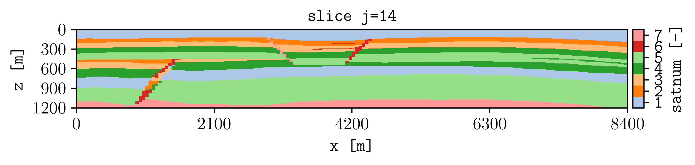

.. _tutorial-first-png:

Generate the first PNG
======================

Plot ``satnum`` on one plane of the SPE11C model (this version of the model has 27 cells along the y axis, then we pick the middle slice).

Command
-------

.. code-block:: console

   plopm -i examples/SPE11C -v satnum -s ,14,

Result
------

How it works
------------

:option:`plopm -i`
   Selects the simulation case.

:option:`plopm -v`
   Selects the quantity to plot.

:option:`plopm -s`
   Selects the plane at ``j=14``.

A PNG is written to the current directory because :option:`plopm -m` defaults
to ``png`` and :option:`plopm -o` defaults to the current directory.

Try this
--------

Plot a summary variable:

.. code-block:: console

   plopm -i examples/SPE11C -v fgmip

Next
----

Continue with :doc:`variables-and-steps`, or see the :doc:`../examples`
gallery for complete recipes.
