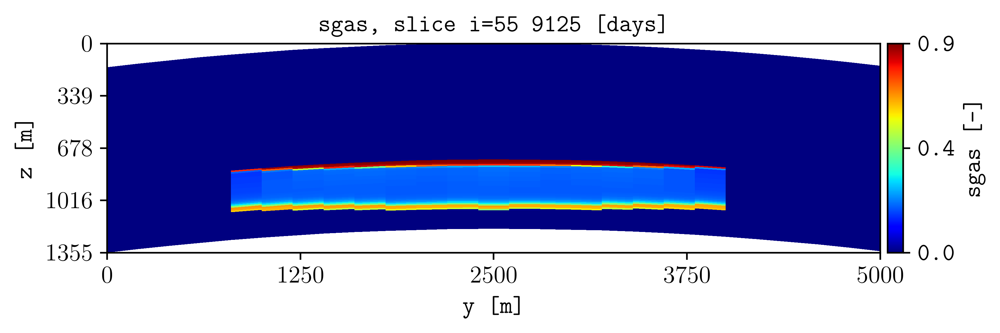
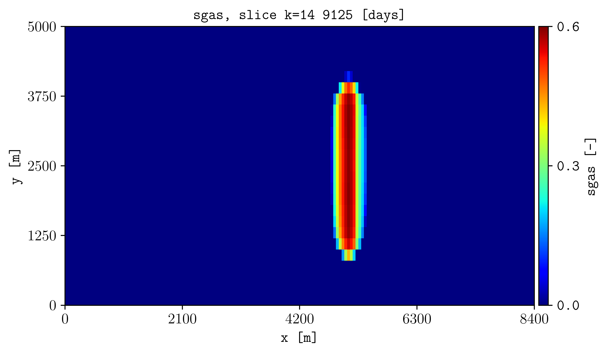

.. _tutorial-model-slices:

Slice the three-dimensional model
=================================

Use ``i,j,k`` selections to inspect SPE11C from different directions.

Commands
--------

.. code-block:: console

   plopm -i examples/SPE11C -v sgas -s 55,, -r 2
   plopm -i examples/SPE11C -v sgas -s ,14, -r 2
   plopm -i examples/SPE11C -v sgas -s ,,14 -r 2

Result
------

.. figure:: ../figs/spe11c_sgas_i,14,k_t2.png
   :alt: Y-slice through a three-dimensional model
   :align: center
   :width: 90%

How it works
------------

The three positions in :option:`plopm -s` select the ``i``, ``j``, and ``k``
indices. Leave two positions empty to select a plane at the specified index.

Try this
--------

Select layers 5 through 10:

.. code-block:: console

   plopm -i examples/SPE11C -v sgas -s 1:170,, -r 2 -cformat .2f

Use ``103,:,50`` for a line or ``55,6,100`` for one cell over time.

Next
----

Continue with :doc:`projections`. See :doc:`../options/selection` for every
selection form.
