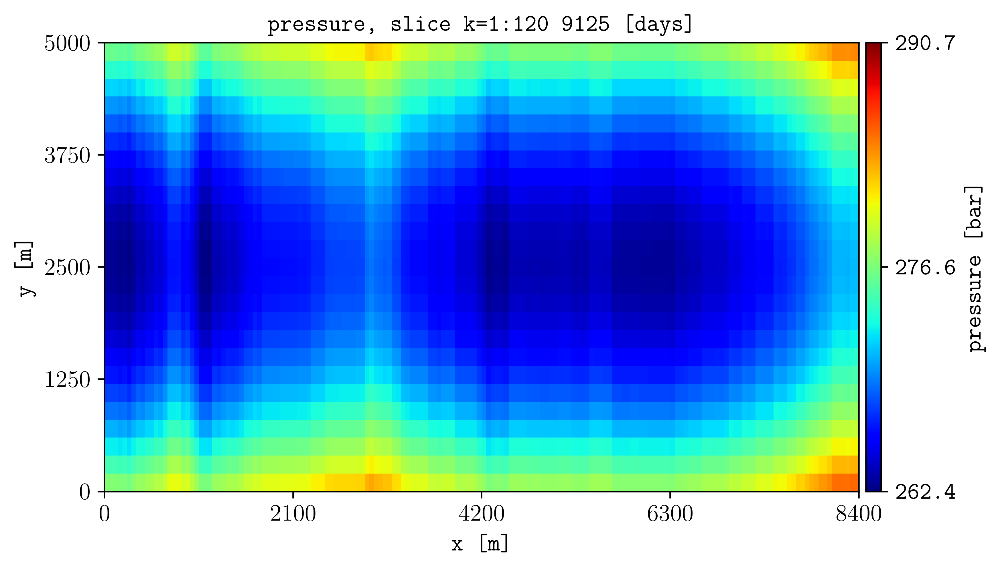

.. _tutorial-projections:

Project and average quantities
==============================

Average a three-dimensional quantity over a selected range.

Command
-------

.. code-block:: console

   plopm -i examples/SPE11C -v pressure -s ,,1:120 -agg pvmean -r 2

Result
------

How it works
------------

:option:`plopm -s`
   Selects layers 1 through 120.

:option:`plopm -agg`
   Applies the pore-volume-weighted mean. Other methods include ``min``, ``max``,
   ``sum``, ``mean``, ``harmonic``, ``arithmetic``, ``first``, and ``last``.

Try this
--------

Replace ``pvmean`` with ``mean`` to use the arithmetic mean. Keep the
variable, restart step, and color limits unchanged when comparing results.

Next
----

Continue with :doc:`appearance`. See :doc:`../options/computation` for all
aggregation and transformation options.
