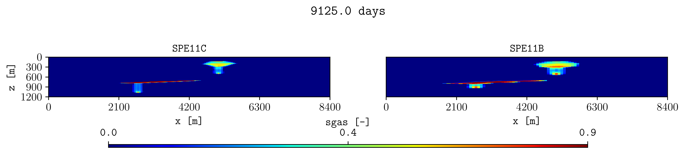

.. _tutorial-subfigures:

Create subfigures and comparisons
=================================

Compare quantities in one figure.

Command
-------

.. code-block:: console

   plopm -i 'examples/SPE11C examples/SPE11B' -v sgas -s ',14, ,1,' -sg 1,2 -fs 12,2.2 -t "SPE11C  SPE11B" -rdl 1

Result
------

How it works
------------

:option:`plopm -sg`
   Creates one row with two panels.

:option:`plopm -fs`
   Sets the total figure size.

:option:`plopm -t`
   Sets panel titles. Two spaces separate titles for different panels.

:option:`plopm -rdl`
   Removes duplicated axis labels.

Try this
--------

Compare the same average quantity at several restart steps with
:option:`plopm -r`, or subtract another case with :option:`plopm -di`. Use
consistent :option:`plopm -cl` values for a fair visual comparison. Change the
colorbar location and size with :option:`plopm -cbp`. Remove the title for
the group of subplots with :option:`plopm -st`.

Next
----

Continue with :doc:`time-dependent-output`. See :doc:`../options/layout` for
subplot controls.
