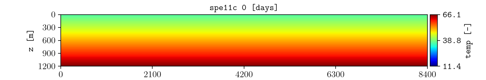

.. _tutorial-time-dependent:

Follow changes over time
========================

Generate an animation of a quantity evolving through the simulation.

Command
-------

.. code-block:: console

   plopm -i examples/SPE11C -v temp -s ,14, -r 0:2:1 -m gif -gi 500 -gl 1 -fs 9,1.5

Result
------

How it works
------------

:option:`plopm -r`
   Selects every second restart step from 0 through 2.

:option:`plopm -m`
   Selects GIF output.

:option:`plopm -gi` and :option:`plopm -gl`
   Set the frame interval and enable continuous looping.

A GIF shows spatial evolution. Selecting one cell with :option:`plopm -s`
produces a temporal view at that location.

Next
----

Continue with :doc:`export`. See :doc:`../options/gif` for all GIF controls.
