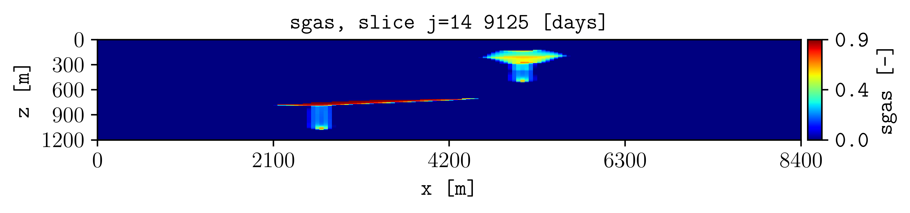

.. _tutorial-variables-steps:

Select variables and restart steps
==================================

Plot a dynamic quantity at a selected simulation step.

Command
-------

.. code-block:: console

   plopm -i examples/SPE11C -v sgas -s ,14, -r 2

Result
------

How it works
------------

:option:`plopm -v`
   Selects a static property, dynamic quantity, special variable, or
   expression.

:option:`plopm -r`
   Selects restart step 2. Use comma-separated values or
   ``start:end[:step]`` to select several steps.

Static properties do not change with restart step. Dynamic quantities such as
pressure and saturation normally do.

Try this
--------

Print the available variables with :option:`plopm -lv`:

.. code-block:: console

   plopm -i examples/SPE11C -lv 1

Next
----

Continue with :doc:`model-slices`. See :doc:`../options/input-data` for the
complete input and variable options.
